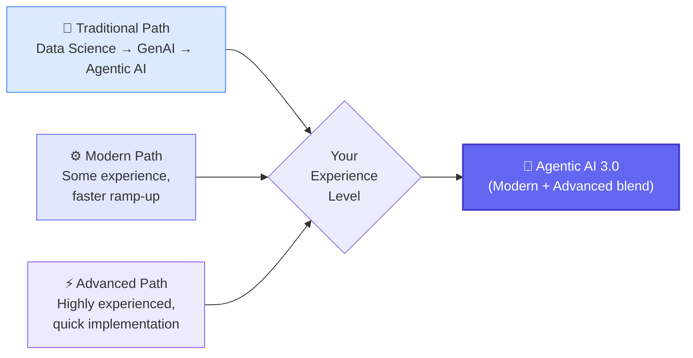
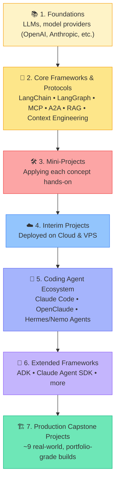
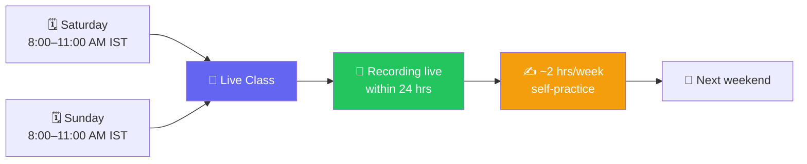
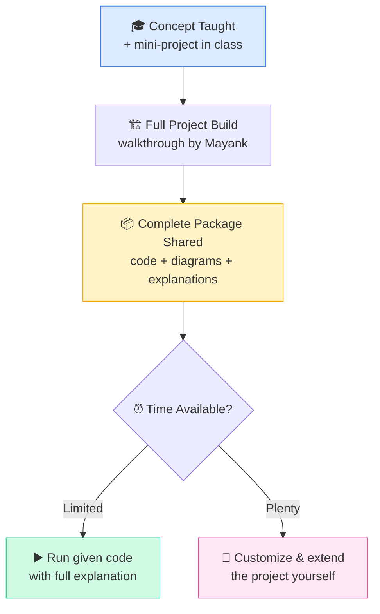

# 🚀 Agentic AI 3.0 Specialization with AgentOps
### 📋 Induction Session Notes — Krish Naik Academy

**🎙️ Speakers:** Krish Naik (Founder) & Mayank Aggarwal (Lead Mentor, ex-Goldman Sachs, NSIT Delhi)
**⏱️ Duration:** ~4.5 hours | **🎯 Session Type:** Batch Induction + Live Q&A

---

## 🧭 Where This Course Fits

Krish Naik Academy maps every learner onto one of three paths. **Agentic AI 3.0 sits between the Modern and Advanced tracks** — built for people who want to go from fundamentals to specialization without starting from zero.

> 💡 **Bonus:** A no-code Agentic AI batch also exists for non-tech managers who want to skip coding entirely.

---

## 🆕 Why 3.0, Not Just 2.0?

| | 🕰️ Agentic 2.0 | 🔥 Agentic 3.0 |
|---|---|---|
| Focus | Understanding agents | **Using & deploying** agents |
| Frameworks | Older LangChain/LangGraph | Latest LangChain, MCP, A2A, Claude Agent SDK |
| Tools | Basic | Claude Code, OpenClaude, Hermes/Nemo agents |
| Projects | Simpler builds | Production-grade, multi-agent, CI/CD-driven |
| New roles covered | — | Harness Engineering, Forward-Deployed Engineer (FDE) |

✅ **2.0 is included free** with 3.0 enrollment — but it's *not* a prerequisite, just a bonus.
✅ New hot topics (like n8n was in 2.0) get **added on an ad-hoc basis** as the field evolves.
✅ Azure/Microsoft AI Foundry, Bedrock, and Vertex AI all get dedicated sessions.

---

## 🗺️ Curriculum Flow

---

## 🏆 Featured Project Demos

### 📄 1. Document-Intelligence RAG Agent
- Built for a **real US-based client**
- Fully **Dockerized** (~20GB image)
- Smart chunking pipeline, not "traditional RAG" — data divided by update relevance
- Auto-comments on tickets/PRs, GitHub PR integration
- 💬 Chat interface for querying uploaded documents

### 🏢 2. Multi-Agent Procurement & Finance System
- Deployed on **Google Cloud Run** (auto-scaling)
- Full **CI/CD pipeline** + Infrastructure-as-Code
- Vector search & embeddings via **Vertex AI**
- Agent squad: 🕵️ Risk Agent · 💰 Tax Agent · 🛡️ Control Agent · 🧑‍💼 Procurement Supervisor
- Generates manager-ready compliance/risk reports on demand

> 🎯 **Goal:** Every project is CV-worthy and mirrors what companies actually deploy — not toy demos.

---

## 📅 Schedule at a Glance

- 🗓️ **Every Saturday & Sunday, 8–11 AM IST**, for **5–6 months**
- 📼 Recordings uploaded to dashboard within 24 hours
- ⏳ Course access valid for **2 years**
- ☕ ~10-min breaks during sessions (occasionally skipped if the class is in flow)

---

## 📱 Platform & Communication Rules

| Do ✅ | Don't ❌ |
|---|---|
| Use the official in-app **Messages** tab for all doubts/updates | Create WhatsApp/Telegram groups (**you will be banned**) |
| Check **Workshop** section for scheduled classes (updated Wed/Thu) | Assume paid tools are required — none are mandatory upfront |
| Download the mobile app for notifications & on-the-go viewing | Skip sharing progress — LinkedIn posts are treated as **non-negotiable** |
| Email the team for account/access issues | Rely only on live class — self-practice is expected |

---

## 💡 How Hands-On Learning Works

Built for working professionals — you're never forced to write everything from scratch, but full code + explanations are always available to go deeper.

---

## 📊 Post-Production KPIs (Mayank's Golden Rules)

> *"Simple is scalable. That's something I've time-tested."* — Mayank Aggarwal

1. 💰 **Cost** — including token usage
2. ⚠️ **Failure Rate** — should trend toward zero
3. ⚡ **Latency** — speed of response
4. ✨ **Quality** — is the output actually useful?

**Engineering philosophy shared during Q&A:**
- 🔻 Minimize external/API/LLM calls — every hop costs time & money
- 🧱 Prefer the simplest system that solves the problem; avoid over-engineering "for scale" that never comes
- 🔀 Use multiple LLMs only when the *problem* demands it (e.g., failover), not by default — calling models in parallel just doubles cost

---

## ❓ Live Q&A Highlights

| Question | Answer |
|---|---|
| Is this course useful across experience levels? | Yes — fundamentals for beginners, system design depth for architects/seniors |
| Do I need paid tools/subscriptions? | No — free/open-source shown first; paid tools are optional and demoed only |
| How do hands-on projects work for busy professionals? | Concepts + mini-projects live, full code & explanations provided after, so you can run first and deepen later |
| Will Microsoft/Azure AI tools be covered? | Yes — dedicated sessions on Azure, Bedrock, Vertex AI, and Foundry |
| What if I have zero Python background? | A Python playlist will be shared as prep material |

---

## ✅ Action Items for Learners

- [ ] 📲 Download the Krishnaik Academy mobile app
- [ ] 💬 Bookmark the in-app **Messages** tab as your only communication channel
- [ ] 🗓️ Block Saturday & Sunday, 8–11 AM IST on your calendar
- [ ] 🐍 Go through the shared Python playlist if you're new to coding
- [ ] 🔗 Connect with Krish Naik & Mayank Aggarwal on LinkedIn
- [ ] ✍️ Post your first learning update after Class 1 — tag the mentors!

---

*📝 Notes compiled from the full induction session transcript — Agentic AI 3.0 Specialization with AgentOps, Krish Naik Academy.*

