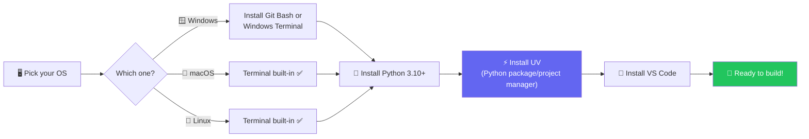
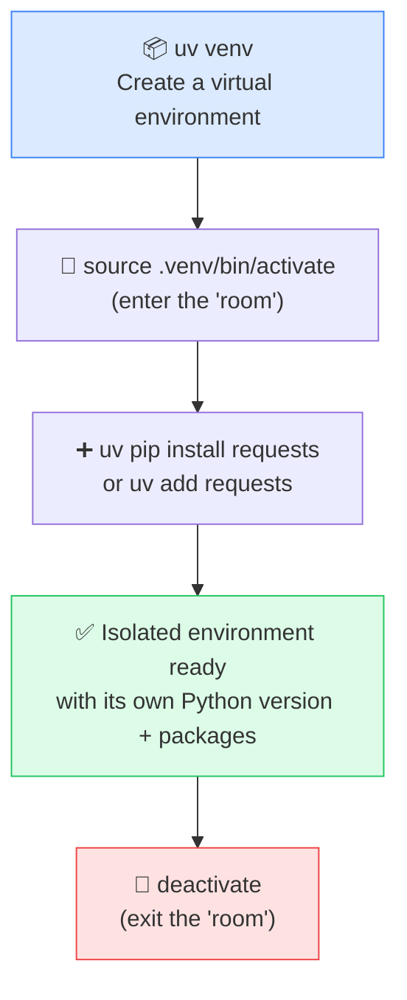
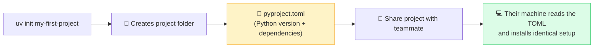
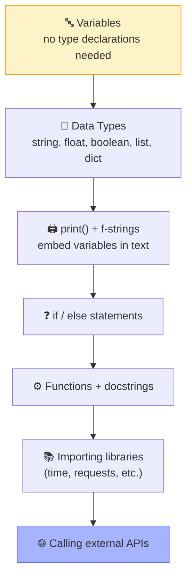
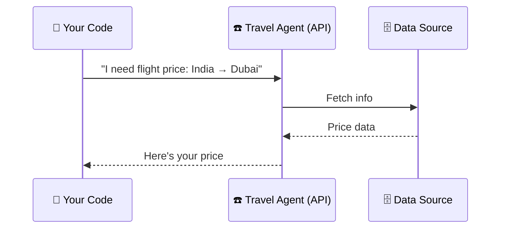

# 🐍 Class 1: Python for AI — Dev Environment & Fundamentals
### 📋 Agentic AI 3.0 Specialization | Krish Naik Academy

**🎙️ Mentor:** Mayank Aggarwal
**⏱️ Duration:** ~4.5 hours | **📅 Session:** First live class (post-induction)

---

## 🎯 Ground Rules Before We Code

> *"Reset your mind and start with a clean slate — that's how we learn best."* — Mayank

| Rule | Details |
|---|---|
| ⏰ **Be on time** | Class starts sharply at **8:00 AM IST**. A grace window was only given in Class 1 — future classes wait max **5 minutes**. |
| 🎥 **Confirm the 3 basics** | Video, Audio, Screen — always confirm you can see/hear before class begins. |
| 📝 **Take notes, don't shadow-code** | Watch and understand live; **practice after class** using the recording — don't try to type along or you'll lose context. |
| 📼 **Recordings + code** | Shared within **10–15 minutes** of class ending, via the dashboard. |
| 🔗 **All commands/links** | Posted in real time to a shared **Craft doc** link (bookmark it — used for 6–8+ months). |
| 💪 **Effort ratio** | For every 1 hour of class, spend **~2 hours** practicing on your own. |

---

## 💻 Setting Up Your Dev Environment



**Why not CMD / PowerShell?**
Mayank's strong recommendation: avoid native Windows CMD/PowerShell for development. Reasons given:
- 🚫 Many Linux-style commands simply fail on CMD
- ☁️ Almost all cloud machines you'll SSH into run **Linux**
- 🎯 Goal: be **platform-agnostic** as a developer

✅ Windows users: install **Git Bash** or **Windows Terminal** instead — both let you run the same commands as Mac/Linux users.

> 💬 On WSL: "It works, but it's a bit heavy and switching between the Linux subsystem and Windows files used to be slow." (Noted this may have improved in recent versions.)

---

## ⚡ UV — The Modern Python & Project Manager

UV replaces the old juggling of `pip` + `venv` + `conda`/`poetry` with **one fast tool** — and it's what Mayank uses throughout the course because it mirrors how modern companies work.



### 🧠 The "Room" Analogy
> *"Think of a virtual environment as a room. `uv venv` builds the room. Activating it means you've walked in. Whatever's installed inside stays inside — the outside world (and its packages) can't see in, and you can't see out."*

- 🧍 **Outside the room (base Python):** all your globally installed packages live here.
- 🚪 **Inside the room (activated venv):** starts empty — nothing exists until *you* install it there.
- 🔁 Every project can have its **own Python version** and **own set of packages** — no conflicts between projects.

### 🗂️ Project-Based Workflow (`uv init`)


> 💡 **Analogy:** Just like a recipe tells you the exact ingredients and quantities (not "some salt"), `pyproject.toml` tells any machine exactly which Python version and libraries a project needs — so it runs identically everywhere. This is conceptually the same as `package.json` in NPM or Maven in Java.

### 📌 Key Q&A on UV
| Question | Answer |
|---|---|
| `requirements.txt` vs `pyproject.toml`, which wins? | UV **only reads `pyproject.toml`**, and honors whichever command (`uv add` vs `pip install -r requirements.txt`) was run **last** |
| Do I still need to "activate" the environment? | Not strictly — you can also just run things through `uv run`/project mode without manually activating. Both work; UV's project-based flow is closer to Java/JS-style dependency management. |
| Mixing `pip install` and `uv add`? | Avoid mixing — stick to one approach per project to prevent version conflicts |
| Upgrade Python version inside a venv? | Yes — `uv python upgrade` |
| Already using conda/miniconda? | Fine to keep, just don't mix conda and UV commands in the same project |

---

## 🧩 Why VS Code (Not Jupyter Notebooks)

- This course is **Agentic AI**, not classic Data Science/ML — so the workflow leans on **`.py` scripts + VS Code**, not notebooks.
- VS Code has a **built-in terminal** — useful since you'll often SSH into remote/cloud machines, not just run things locally.
- Debugging in VS Code is described as "way easier" than notebook-style debugging once you're used to it.

---

## 🐍 Python Fundamentals Covered



### 🔑 Highlights
- **No type declarations** — unlike C++/Java, Python variables are just assigned directly (`x = 5`, not `int x = 5`).
- **f-strings** let you drop variables into printed text:
  ```python
  city = "Tokyo"
  print(f"{city} is great")
  ```
- **Functions should have docstrings** — since this is an AI-focused course, clear docstrings matter a lot (agent tooling relies on them later).
- `if __name__ == "__main__":` was flagged as something to **go learn independently** — will be explained properly in an upcoming class.

---

## 🌐 Understanding APIs (Before Touching Frameworks)

### 🧠 The Analogy
> *"If I hand you an old keypad phone with no internet and ask for a flight price from India to Dubai, what do you do? You call a travel agent, tell them your requirement, and they call you back with the price."*



That's exactly what an API call is: **your code asks another service for data, and gets a response back.**

### 🛠️ Live Demo: Currency Exchange API
Built a simple script using the `requests` library to hit a live currency-exchange API:
```python
import requests

response = requests.get(url, params=params, timeout=10)
```
- `timeout=10` → *"like hanging up on a call if no one answers in 10 seconds."*
- Demonstrated fetching a **real-time USD → INR** rate and verifying it matched a live web search.
- Reinforced: **if your code needs outside data, it needs an API** — this is exactly how you'll later call LLMs (OpenAI, Anthropic, etc.).

---

## 🗣️ Framework Philosophy

> *"Agent is a concept — you should never learn a concept through a framework first. I'll teach you to build agents using plain Python before we touch LangChain."*

This is intentional: most courses jump straight to LangChain/LangGraph. Mayank's approach is fundamentals → then frameworks, so the underlying concepts are rock-solid.

---

## 💼 Bonus: Live Job Referrals Shared

Mayank shared **two real openings** via his ex-manager (now Global AI Head at Puma):

| Role | Location | Notes |
|---|---|---|
| 🧑‍💻 MLOps Engineer | Bengaluru HQ (not remote) | Direct referral opportunity |
| 🧑‍💼 Senior Manager, AI Engineer | Bengaluru HQ (not remote) | Direct referral opportunity |

📩 **How to apply:** Email Mayank directly with subject line `Job | Role | Puma`, including CV + relevant experience — **only if genuinely qualified** ("referrals carry weight, don't misuse them").

---

## ❓ Live Q&A Highlights

| Topic | Key Takeaway |
|---|---|
| 🎓 Is this course right for non-tech / semi-tech folks? | Doable but will need **extra self-effort** (~double the class time) — course assumes basic dev comfort |
| 🧑‍💻 GitHub Copilot vs Claude Code? | Mayank personally finds **Claude Code better** for development; full Claude Code learning material available on his YouTube channel |
| 🔍 Tool to auto-understand an unfamiliar codebase/architecture? | No dedicated magic tool — feed the repo/docs to **Claude or ChatGPT** (e.g. via GitHub MCP) and ask it to summarize |
| 🏢 Need help finding AI use cases at work? | Mayank has a **handbook** mapping AI opportunities across industries/domains — to be shared |
| ⏱️ Should I code along during class? | **No** — just watch/understand live, then practice using the recording afterward |
| 🐍 Do I need Python experience already? | Helpful but not mandatory — beginners are expected, but should reinforce basics fast |
| 🤖 Will Microsoft Copilot Studio be covered? | Only if Mayank can get access; **GitHub Copilot** will be covered |

---

## ✅ Action Items After Class 1

- [ ] 🐍 Install **Python 3.10+**
- [ ] ⚡ Install **UV** and practice creating/activating a virtual environment
- [ ] 🧩 Install **VS Code** + confirm integrated terminal works
- [ ] 🪟 Windows users: install **Git Bash** or **Windows Terminal**
- [ ] 📺 Watch Mayank's **Python crash course** & **UV** videos if fundamentals feel shaky
- [ ] 🔁 Re-practice today's commands using the **recording** (don't rely on live memory)
- [ ] 📖 Look up `if __name__ == "__main__":` before next class
- [ ] 💼 If genuinely qualified: send CV for the Puma roles with the correct subject line

---

*📝 Notes compiled from the full Class 1 transcript — "Python for AI," Agentic AI 3.0 Specialization, Krish Naik Academy.*
