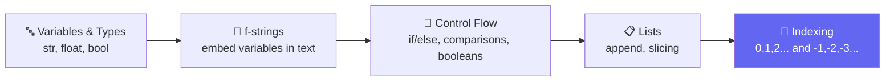
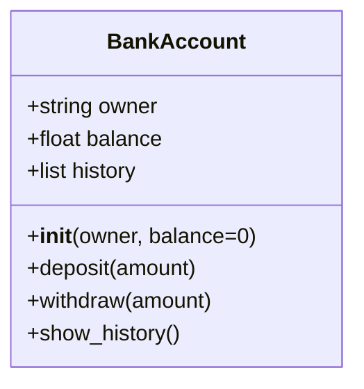
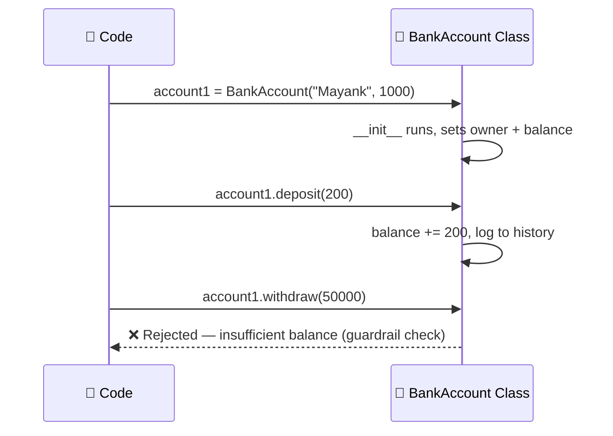
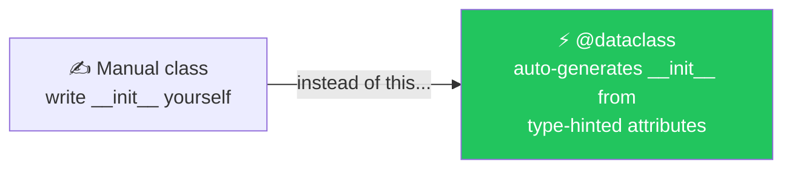
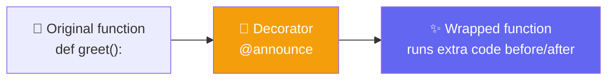
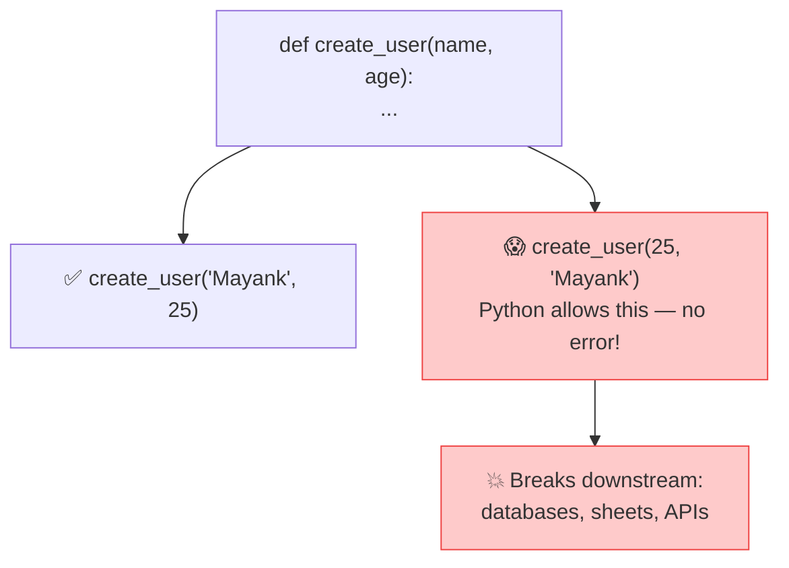
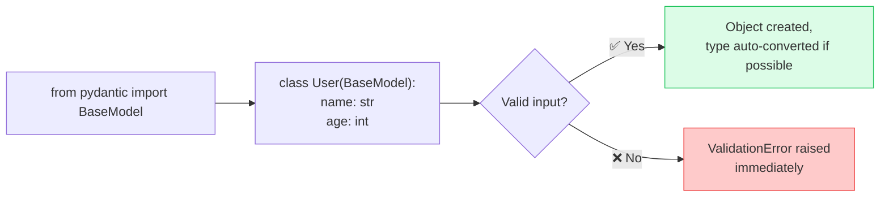
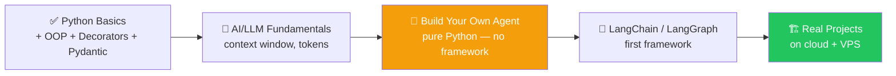

# 🧱 Class 2: Python Refresher — OOP, Decorators & Pydantic
### 📋 Agentic AI 3.0 Specialization | Krish Naik Academy

**🎙️ Mentor:** Mayank Aggarwal
**⏱️ Duration:** ~4.5 hours | **📅 Session:** Day 2 (28 June 2026)

---

## 🪟 Windows Fix-Up (Housekeeping)

Several learners hit setup issues on Windows in Class 1. Mayank live-debugged it:

- ⚠️ **Never open PowerShell** for this course — always use **Git Bash** in VS Code's terminal instead.
- `uv init` on Windows creates the project the same way as Mac/Linux, just with Windows-style paths (e.g. `C:\Users\...`).
- Activation command differs by OS — when stuck, **ask ChatGPT/MayankGPT** to translate a Mac command to your OS rather than memorizing every variant.

> 💬 *"Now I don't want a single comment that Windows wasn't shown — operating system doesn't matter once you're developing at this level."*

📍 **Resource hub reminder:** recordings, code, and notes are all centralized — Craft doc (live notes/links), GitHub (code), and a custom **"MayankGPT"** doubt-solving assistant trained on course content.

---

## 🔁 Quick Refresher: Variables, Types & Lists



**Indexing cheat sheet** (list `["Tokyo", "Delhi", "London"]`):

| Index | 0 | 1 | 2 |
|---|---|---|---|
| Value | Tokyo | Delhi | **London** |
| Negative Index | -3 | -2 | **-1** |

> 💡 Mayank has a dedicated deep-dive video on indexing/slicing on his channel — flagged as unusually in-depth compared to most tutorials.

---

## 🏛️ Object-Oriented Python — The Bank Account Example

Taught live using a **Bank Account class**, drawn out step-by-step in Excalidraw before being coded.



### 🧠 How It Works


- `self` refers to the specific object instance — Mayank pointed to his dedicated YouTube explainer for a deeper dive rather than a one-line definition.
- `__init__` sets up default values (e.g. `balance=0` unless specified).
- Methods like `.deposit()` and `.withdraw()` operate on `self.balance` and append entries to `self.history`.
- Attempting to withdraw more than the balance is a simple example of a **guardrail check** — foreshadowing agent safety patterns.

---

## 📦 DataClasses — Killing the Boilerplate

> *"Developers are lazy for problems that have already been solved — that's exactly why `@dataclass` exists."*



```python
from dataclasses import dataclass, field

@dataclass
class Book:
    title: str
    author: str
    pages_read: int = 0
    tags: list = field(default_factory=list)
```

- 🎯 **Analogy:** *"Like filling a library card — you just declare what fields a book has, and Python writes the repetitive setup code for you."*
- `field(default_factory=list)` is needed for **mutable defaults** (lists/dicts/sets) — a common gotcha most beginners hit.
- Comparable to **Lombok** in Java for anyone with a JVM background.
- ⚠️ DataClasses **don't validate types** — they just remove boilerplate. That gap is exactly what Pydantic solves next.

---

## 🎁 Decorators — Wrapping Functions Without Changing Them

### 🧠 The Gift-Wrap Analogy
> *"A decorator is like wrapping a gift — the contents (your original function) don't change, but you get extra behavior added around it."*



```python
import functools

def announce(func):
    @functools.wraps(func)
    def wrapper(*args, **kwargs):
        print(f"Starting {func.__name__}...")
        result = func(*args, **kwargs)
        print(f"Ending {func.__name__}...")
        return result
    return wrapper
```

### 🔑 Key Concepts Unpacked
- **Functions are first-class objects in Python** — you can pass a function in, and return a function out.
- `@decorator` above a function is shorthand for `func = decorator(func)`.
- `functools.wraps` preserves the original function's name/metadata (`__name__`) — without it, introspection tools see `wrapper` instead of your real function name.
- If a wrapped function doesn't explicitly `return`, calling `print()` on it shows `None` — a common beginner trip-up, explained live via a runtime demo.
- **`*args`** = positional arguments, **`**kwargs`** = keyword arguments (dictionary-style key-value pairs) — flagged as a topic to cover separately in more depth.
- 🔗 **Why this matters for the course:** agent *tool definitions* (e.g. `@tool` decorators) use exactly this pattern — this lays the foundation for defining tools agents can call later.

---

## ⚠️ The Problem: Python Is Not Type-Safe



- Python is **dynamically typed** — it never enforces that `name` is a string or `age` is an int at runtime, even with type hints.
- Manually adding `if isinstance(...)` checks in every function works, but doesn't scale once you have 10+ functions (`create_user`, `update_user`, `delete_user`...).
- This exact pain point — validated data in vs. out — is what makes **Pydantic** essential for AI agent development.

---

## 🛡️ Pydantic — Enforcing Data Contracts



```python
from pydantic import BaseModel

class User(BaseModel):
    name: str
    age: int

user = User(name="Mayank", age="25")  # ✅ "25" auto-converted to int
user = User(name="Mayank", age=[1,2]) # ❌ ValidationError — list isn't a valid int
```

### 🎯 Why It Matters for This Course
> *"Pydantic helps us create rigid data models for our inputs and outputs — making our code and agents more error-safe. We can enforce type AND data validation."*

| DataClass | Pydantic BaseModel |
|---|---|
| Removes boilerplate only | Removes boilerplate **+ validates types** |
| No runtime enforcement | Raises `ValidationError` on bad input |
| Good for simple internal data structures | Essential for **API inputs/outputs**, agent tool schemas |

📌 **Where you'll use this going forward:** every **FastAPI server** the course builds will use Pydantic models to define request/response shapes — and later, structured outputs from LLMs will be parsed and filtered using Pydantic models too (confirmed in Q&A).

---

## 🗺️ What's Coming Next (Roadmap Mayank Shared)



> *"I don't want you choosing something handed to you on a platter. You get paid for understanding *why* something fails — not for gluing frameworks together."*

---

## 💬 Live Q&A Highlights

| Question | Answer |
|---|---|
| Why learn agents in raw Python before LangChain/LangGraph? | Frameworks are "mature and convenient" (like WhatsApp vs. SMS), but you should understand the fundamentals underneath first |
| Do frameworks cost more in tokens? | Yes — Mayank **personally avoids agent frameworks** in his own production solutions when possible; prefers simple **API orchestration** to control token cost and execution |
| Can Pydantic filter/structure messy LLM output? | Yes — define the desired structure as a Pydantic model and extract exactly what you need |
| GraphQL vs REST — covered? | Not as a core topic, but may show up in a project (e.g. around observability/OpenTelemetry) |
| Node.js/TypeScript instead of Python for agents? | LangChain/LangGraph support TypeScript too — language is a implementation detail, not a limiter |
| DevOps use cases for agents? | Framed as **"mini interns"** — code review, infra provisioning, and repetitive ops tasks are good candidates |
| Is "vibe coding" enough to ship an app to the Play Store? | Gets you ~80–90% of the way; still get a developer to review security/data-handling before publishing |
| Guardrails for sensitive data? | Will be covered later using dedicated guardrail frameworks |
| Deployment/AgentOps — when? | Comes after the fundamentals + framework phase, roughly ~1.5–2 months in; will use VPS/cloud |
| Difference vs. Agentic 2.0? | 3.0 is far more **project- and AgentOps-focused**, with newer tools (Claude Code, latest LangChain, etc.) reflecting how fast the space has moved |

---

## ✅ Action Items After Class 2

- [ ] 🪟 Windows users: confirm Git Bash works in VS Code terminal (not PowerShell)
- [ ] 🔁 Re-run today's `.ipynb` refresher files from GitHub on your own
- [ ] 🏦 Rebuild the **BankAccount** class yourself from scratch (don't just copy-paste)
- [ ] 📦 Practice writing a `@dataclass` and a simple custom `@decorator`
- [ ] 🛡️ Practice defining a **Pydantic BaseModel** and triggering a validation error deliberately
- [ ] 📖 Look up `*args` and `**kwargs` in more depth before next class
- [ ] 🧠 Come to next class ready to cover **AI/LLM fundamentals**: context window, tokens, and building your first agent in pure Python

---

*📝 Notes compiled from the full Class 2 transcript — "Python Refresher: OOP, Decorators & Pydantic," Agentic AI 3.0 Specialization, Krish Naik Academy.*
