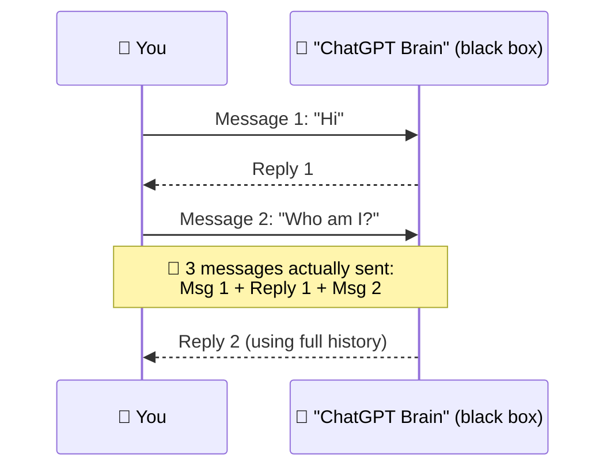
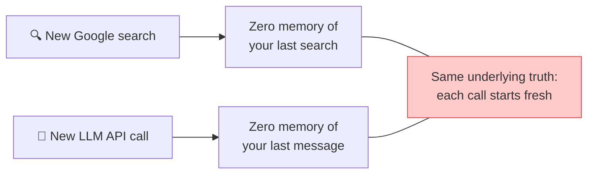
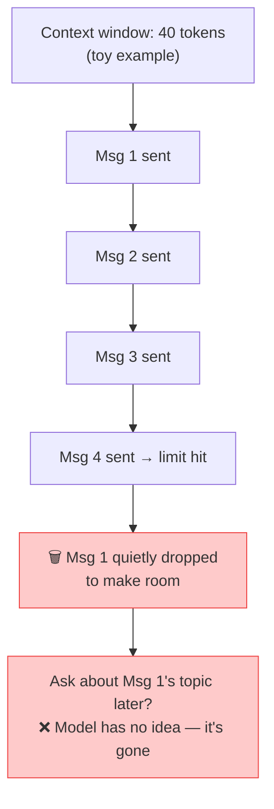
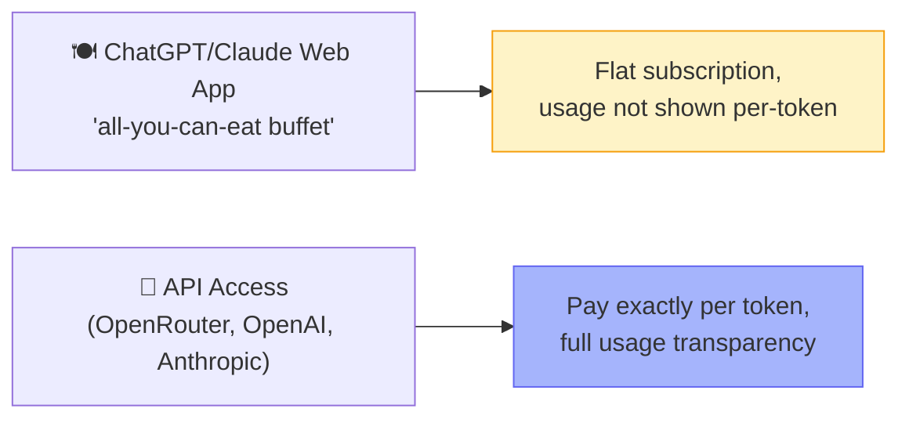
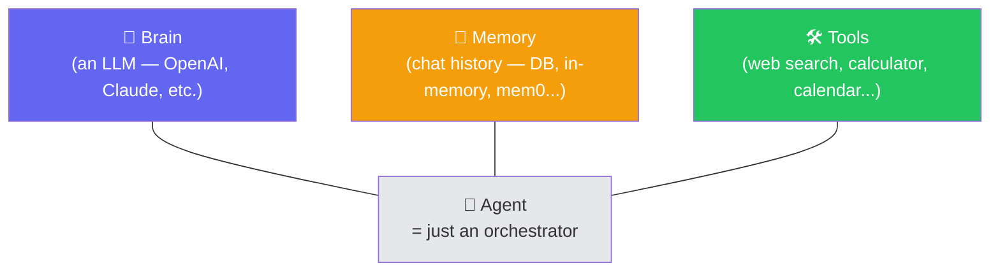
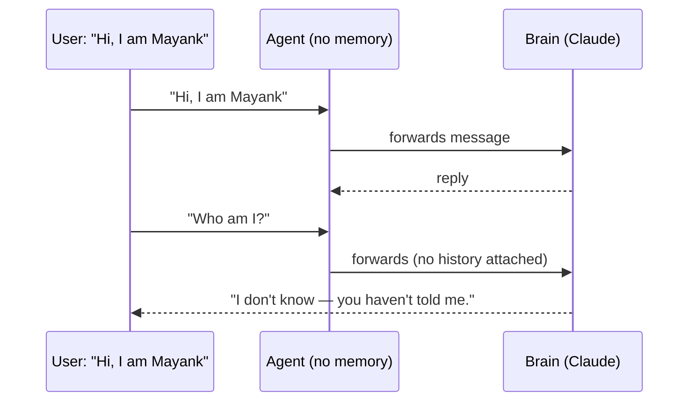
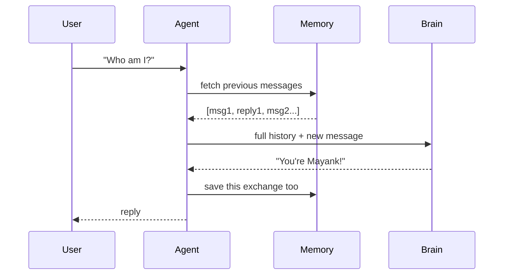
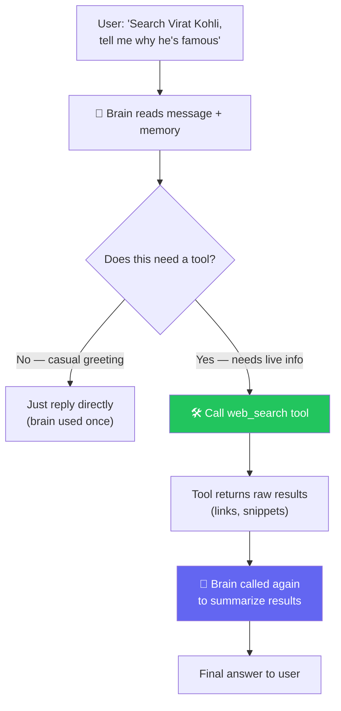
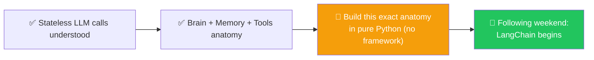

# 🤖 Class 4: LLMs Are Stateless & The Anatomy of an Agent
### 📋 Agentic AI 3.0 Specialization | Krish Naik Academy

**🎙️ Mentor:** Mayank Aggarwal
**⏱️ Duration:** ~4.5 hours | **📅 Session:** Day 4 (5 July 2026)

---

## 🔁 Quick Recap of Class 3

- ✅ **Pydantic** — why it exists, `BaseModel`, `Field()` constraints, `field_validator` vs `model_validator`, nested models.
- ✅ **AI vocabulary** — LLM, Tokens, Vector Embeddings, Context Window, Parameters.
- 🎵 Fun aside: Mayank shared an **AI-generated song** created for the class as part of exploring generative AI tools.

> 💬 *"You never remember code — you understand concepts. Thanks to AI, syntax is cheap to look up; understanding *why* is what makes you valuable."*

---

## 🧠 The Most Important Idea Today: LLM Calls Are Stateless

### 🎯 Setting It Up
> *"When I send ChatGPT a message, does it just go to a 'brain' sitting on a server, and I get a reply?"*

Mayank pushed the class hard on this before allowing any "it's more complex than that" answers — deliberately keeping the mental model simple before layering in nuance.

### 💡 The Core Insight
> **"AI, LLM, ChatGPT, Claude — every single time, you give it an input and it gives you an output. It doesn't remember anything on its own."**

- This is why the term **"stateless"** applies: the model holds no internal state between calls.
- What *looks* like memory in a ChatGPT/Claude conversation is really: **the entire chat history gets resent with every single message.**
- 🔬 **Live proof:** Mayank showed a Claude session where a single "hi" ballooned to **35,000+ tokens** due to hidden system prompts/MCP context, and watched token counts climb steadily as the conversation grew — directly demonstrating the full history being resent each turn.

### 🖊️ Why This Explains "AI Getting Dumb" in Long Chats

- Live-demoed with a small custom tool: set context window to 40 tokens, watched earlier messages visibly **gray out** as new ones pushed them out.
- This is *exactly* why: long conversations get slow, expensive, and forgetful — every single turn resends everything still "in view."
- Practical takeaway: **starting a new chat** isn't just tidiness — it resets the resent-history cost to zero.

---

## 🌐 Web App vs. API — "The Buffet vs. À La Carte"

> *"Companies want you locked into the web app — more people using their model, more stickiness. But when you're building software, you need the API."*

### 🛠️ Live Demo: OpenRouter
- **OpenRouter** = one place to access models from **every** major provider (OpenAI, Anthropic, Google, Mistral, etc.) with a single API key.
- Walked through: create an API key → free-tier model → hit the endpoint → confirm the response and **exact token breakdown** (input/output) in the dashboard.
- 🎯 Reinforces: tokens are the literal unit you're billed on — visible and countable, unlike the "unlimited-feeling" web app.

---

## 🏗️ The Anatomy of an Agent — Brain, Memory, Tools

> *"Once you understand this without any framework or code, LangChain, LangGraph, CrewAI — all of it — becomes trivially easy. They're all doing exactly this, nothing more."*

### 🧠 The Intern Analogy
> *"Think of an agent as hiring an intern. Give them a laptop with no skills (a weak brain) and they can't do much. Give them a great brain but no tools, and they still can't act in the world. The agent itself has zero intelligence — it's just code moving data between the brain, memory, and tools."*

- A weak/cheap model (e.g. a fast, low-cost model) as the "brain" will **fail on complex tasks** — the brain's capability is a hard ceiling on what the agent can do, no matter how good your orchestration is.
- **The agent is not smart.** Only the brain (LLM) makes decisions. The agent code is plumbing.

### 🔴 Live Demo (visual workflow tool, purely for illustration — not taught as a framework)

**Step 1 — Brain only, no memory:**

❌ Fails — no memory means no continuity, even in the *same* session.

**Step 2 — Add memory:**

✅ Now it "remembers" — but note the brain is hit **once**, memory is read/written around it. A fresh chat session = zero memory again (this is *short-term* memory; *long-term* memory across sessions is a separate, later topic).

**Step 3 — Add tools (calculator + web search):**

- Each tool has a **description** (auto-generated or manually set) — this description is what gets sent to the brain so it knows the tool exists and what it's for.
- 🔑 **Key realization:** the brain decides *whether* to use a tool at all. A casual "hi" → no tool call. A factual question → tool call, then a second brain call to summarize the raw results into a clean answer.
- This is literally what "agentic flow" means: **brain → decide → maybe tool → brain again → respond.** Live demo showed the step count visibly jump from 1 call to 2+ calls once a tool was actually invoked.

---

## 🗺️ What's Next

> *"Once your basics are this clear, frameworks like LangChain will feel almost too easy — because you'll recognize they're doing exactly what we just did by hand."*

---

## 💬 Live Q&A Highlights

| Question | Answer |
|---|---|
| Does GitHub Copilot / Claude send our company's private repo code to a shared external database? | No — providers don't pool/store your code in some central shared repo across companies |
| Why are input tokens charged at all if you're "just asking a question"? | Every token — input or output — has to be processed by the model; a PDF you upload as input still costs tokens, same as a phone call being billed from the moment you start talking |
| Is a "vector" the same as an "embedding"? | Practically yes in this context — they're used interchangeably here (RAG-specific embedding usage is a distinct, later topic) |
| Are the LLM model and the embedding model the same thing? | No — they're different, specialized models |
| What is cosine similarity? | A method to measure how "close" two vectors are to each other in that space — used to check semantic similarity |
| Do parameters change every time a user chats with the model? | No — parameters are fixed after training; they only change when a new model version is released |
| Is there a "best" embedding model? | No universal best — depends entirely on the use case |

---

## ✅ Action Items After Class 4

- [ ] 🧠 Be able to explain **"LLM calls are stateless"** in your own words, with an example
- [ ] 🖊️ Practice explaining the **context window "whiteboard" analogy** to someone else — best test of real understanding
- [ ] 🔌 Try creating a free **OpenRouter** API key and hitting a model directly (outside the web UI)
- [ ] 🏗️ Memorize the **Brain → Memory → Tools** anatomy — this is the mental model every framework (LangChain, LangGraph, CrewAI) will map onto
- [ ] 🔁 Revise: why does a weak "brain" model fail even with perfect tools and memory?
- [ ] 📖 Come prepared next class to build this exact agent anatomy in **pure Python**, no framework

---

*📝 Notes compiled from the full Class 4 transcript — "LLMs Are Stateless & The Anatomy of an Agent," Agentic AI 3.0 Specialization, Krish Naik Academy.*
