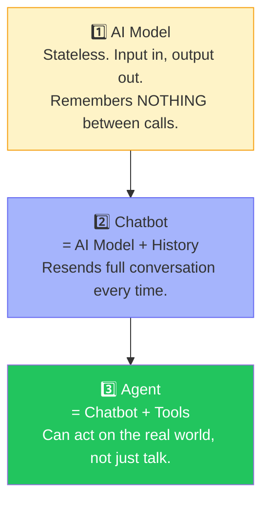
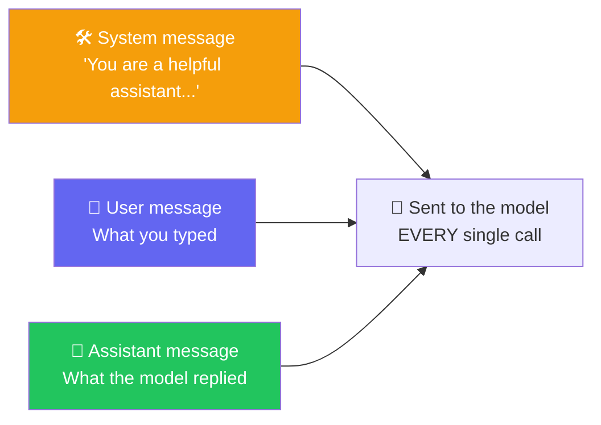
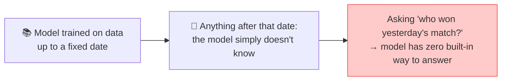
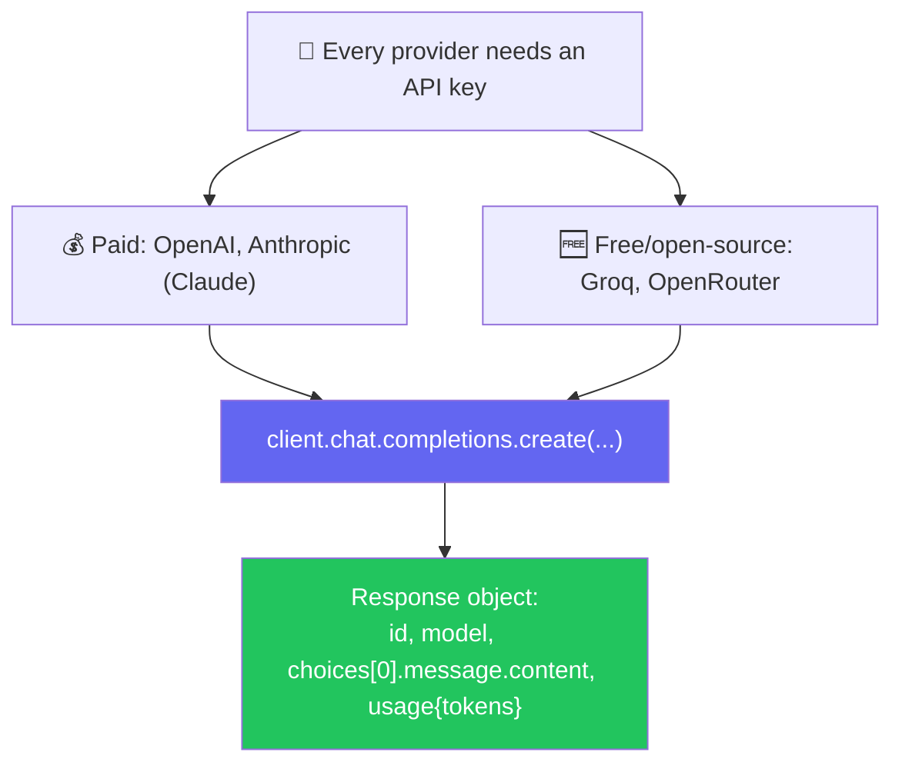
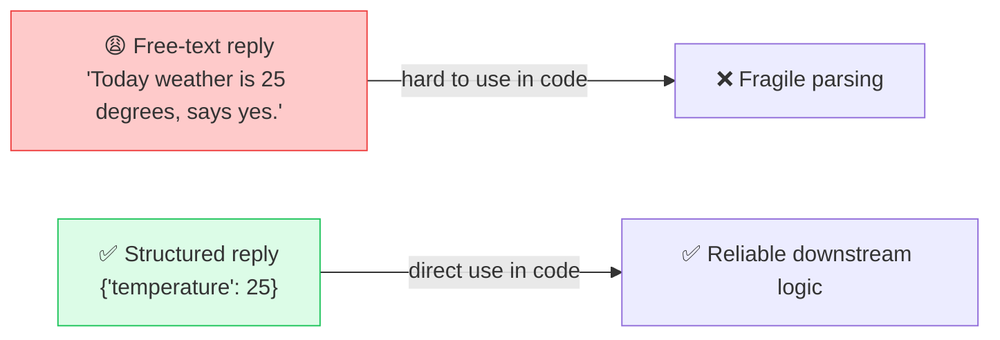
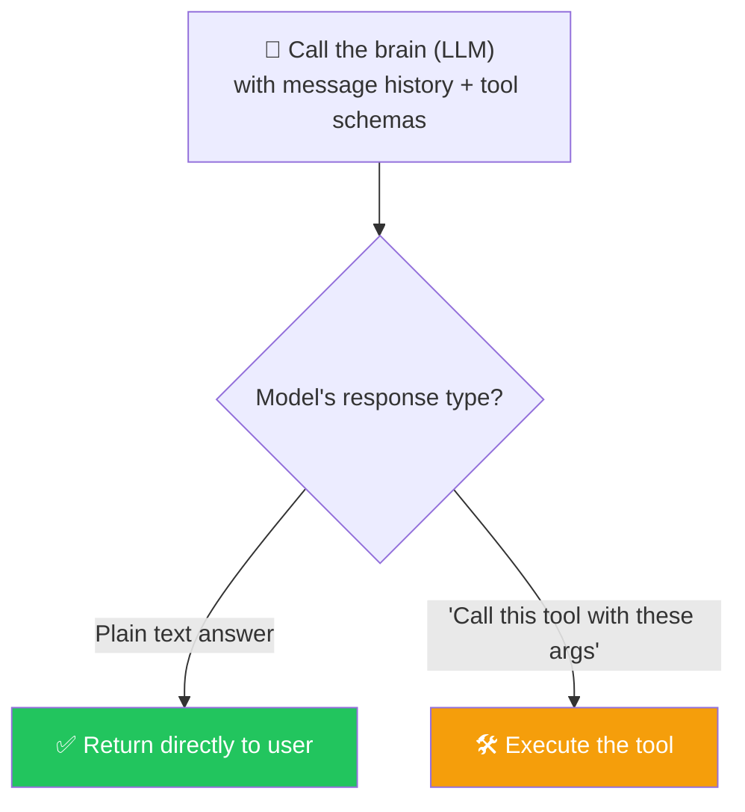
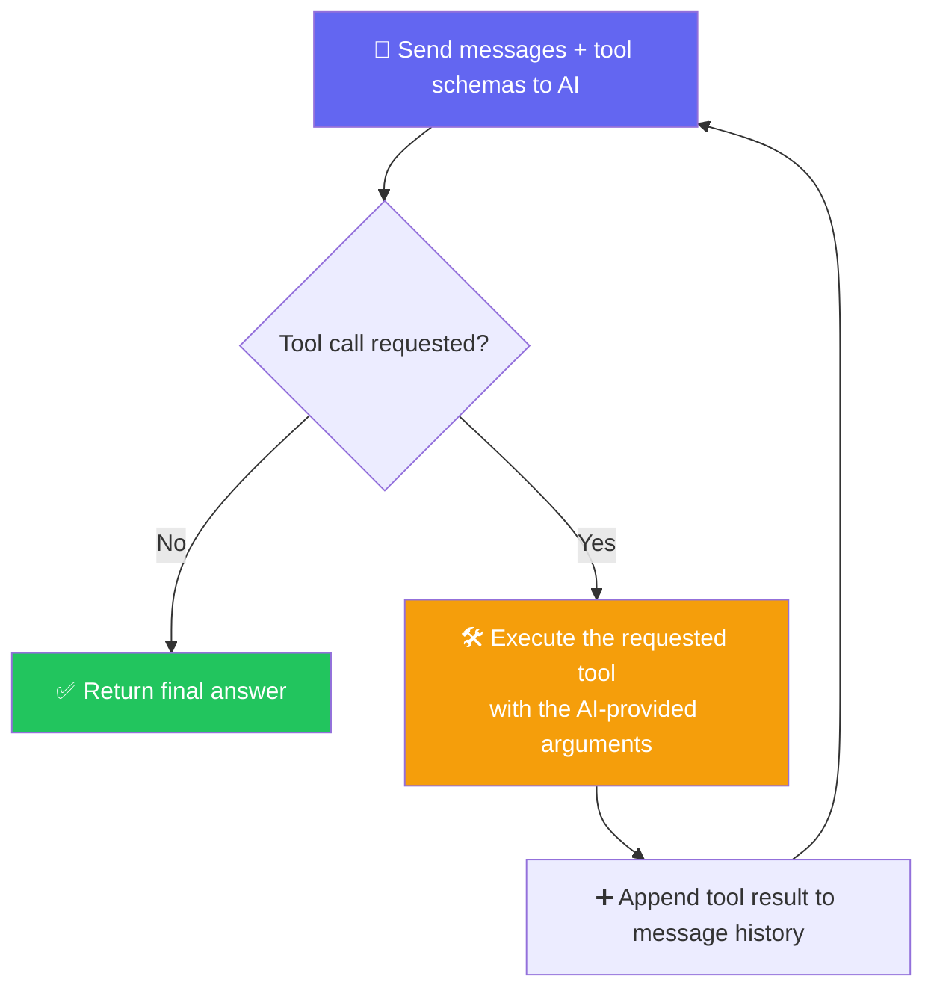
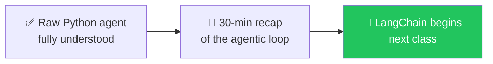

# 🔁 Class 5: Building Real Agents in Pure Python — The Agentic Loop
### 📋 Agentic AI 3.0 Specialization | Krish Naik Academy

**🎙️ Mentor:** Mayank Aggarwal
**⏱️ Duration:** ~4.5 hours | **📅 Session:** Day 5 (11 July 2026)

---

## 📍 Where This Class Sits

> *"I know I would have started with LangChain to make everyone happy — but believe me, now you'll actually **appreciate** LangChain instead of just copy-pasting it."*

This class builds a real, working agent using **only vanilla Python** — no frameworks — by progressively unwrapping each layer: AI Model → Chatbot → Agent → Agentic Loop. LangChain formally begins next class.

---

## 🪜 The Three-Layer Hierarchy: AI Model → Chatbot → Agent



- **AI Model**: *"A single one-shot prediction. Takes a question, returns an answer, remembers nothing before or after."*
- **Chatbot**: *"AI + memory."* Every `.ask()` call appends both the question and answer to `self.history`, and that **entire history** gets resent on the next call.
- **Agent**: Chatbot + **tools** (web search, calculator, currency converter, etc.) — because a raw model **cannot** check anything in the real world; it can only talk with better memory.

> 🔑 **Why this matters commercially:** *"You cannot just tell a client 'let's use ChatGPT inside your app.' The base model has no tools, no live data access — that's exactly the gap agents close."*

---

## 💬 System / User / Assistant — The 3 Message Roles



- 🔬 **Live proof:** Sending a single "hi" to a model still resulted in **3 messages** actually transmitted — system + user + assistant reply so far — confirmed by inspecting the raw request payload in a playground.
- The **system message is optional** — it's good practice, not mandatory — and it's **resent on every single call**, because (as established last class) the model is stateless and remembers nothing on its own.
- 🎯 This is exactly what MayankGPT's custom instructions are: a system message telling it to explain things via analogies.

---

## 📅 Knowledge Cutoff — Why Models "Don't Know" Recent Events



- Every model card lists a **knowledge cutoff date** — live-checked on a just-released model's spec page.
- 🔬 **Live demo:** asked a model about a recent sports result → it honestly admitted no real-time access, confirming: **by default, a raw model cannot browse the web.** (ChatGPT's *web app* layers browsing on top — the base model API call does not have this by default.)
- This is precisely *why* agents need **tools**.

---

## 🔌 Calling Real Models — Paid vs. Free APIs



### 🛠️ Live Demos
- **OpenAI:** created a fresh API key, called `client.chat.completions.create(model=..., max_tokens=200, messages=[...])`, and printed the **raw response object** to show the real shape: `id`, `model`, `choices[0].message.content`, and a `usage` block with `prompt_tokens` / `completion_tokens` / `total_tokens` — matched exactly against the OpenAI dashboard's usage log.
- **Groq (GROQ, not Elon Musk's Grok):** free, high-speed access to open-source models (Llama, GPT-OSS, etc.) — demoed that **Groq's endpoints are OpenAI-compatible**, meaning the exact same client code works just by swapping the `base_url` and key.
- 🎯 Takeaway: *"Every AI model in the world, right now, for you, is just an API call. Gemini, Grok, DeepSeek, Sol — all of it."*
- `max_tokens` caps the **output** length — a safety net against runaway cost if a key ever leaks.

---

## 📦 Structured Output — Why Plain Text Replies Aren't Enough

> *"If your app needs to know the temperature, would you rather parse `'Today weather is 25 degrees'` out of a sentence, or just receive `{"temperature": 25}`?"*



### Two Ways to Get Structure
1. **Prompt-engineered instruction** (what was built by hand today): prepend an instruction like *"Reply with only a JSON object in this exact shape: {city, wantsFahrenheit}"* as part of the **user** message, then parse the JSON string back into Python.
2. **Pydantic-defined schema** (cleaner, reusable): define a `BaseModel` (e.g. `class WeatherQuery(BaseModel): city: str; wants_fahrenheit: bool`) and reuse it everywhere instead of retyping the JSON instruction by hand.
3. 🔮 Foreshadowed: providers also support a native **structured output** mode where you pass the Pydantic schema directly as `response_format` — LangChain will make this trivial (coming next class).

> 💬 *"Rather than typing 'reply in JSON with subject and body' every time, just define the model once with Pydantic and reuse it. That's real code reusability."*

---

## 🧠 The Big One: The Agentic Loop

> *"This is very, very difficult to teach — no agentic course starts by explaining this in raw Python. I know it's painful, but this is what makes LangChain finally make sense instead of feeling like magic."*

### Step 1 — AI Decides: Answer or Call a Tool?


- Each tool is described via a **tool schema** — this schema (name, description, expected parameters) is what's sent to the model so it can intelligently decide *whether* and *how* to call it.
- 🔬 **Live proof:** asked a question with no matching tool defined (currency conversion, with no currency tool present) → model correctly gave a plain-text answer instead of hallucinating a tool call, because it genuinely had no tool available for that.

### Step 2 — The Loop


```python
for _ in range(max_iterations):  # e.g. max_iterations = 4
    response = call_ai(messages, tools=tool_schemas)
    if response.no_tool_call:
        messages.append({"role": "assistant", "content": response.content})
        return response.content
    else:
        result = call_tool(response.tool_name, response.tool_args)
        messages.append({"role": "tool", "content": result})
        # loop again — AI now sees the tool result and decides the next step
```

> 🎯 **This is the "Agentic Loop"** — the reason it's called that: the AI is repeatedly called in a loop, deciding at each step whether it has enough information to answer, or needs to call another tool first. A `max_iterations` cap (demoed as 4) prevents infinite loops.

### 🧩 Why the Loop Runs *Again* After a Tool Call
> Live Q&A clarified: after a tool executes and its result is appended to the messages, the **AI must be called again** with that new information — because the AI is stateless and doesn't automatically "know" the tool ran; the tool's output has to be explicitly fed back in as another message before the model can use it to form a final answer.

---

## 🗺️ What's Next



> *"No one can explain this better without going through Python first. Every framework — LangChain, LangGraph, CrewAI — is doing exactly this loop underneath. Once you've built it by hand, the framework becomes a convenience, not a mystery."*

---

## 💬 Live Q&A Highlights

| Question | Answer |
|---|---|
| Why call the AI again after the tool already ran? | The AI is stateless — it doesn't know the tool's result until that result is explicitly appended to the message history and sent back in |
| Can AI return multiple tool calls at once? | Yes, that's possible depending on the model/provider |
| Is response format handled by custom code or by a framework here? | By hand-written code in this class — LangChain will handle this natively starting next class |
| Why use Pydantic instead of just writing the JSON instruction directly in the prompt? | Reusability, defaults, validation, and cleaner code — define the schema once, use it everywhere |
| Is the system message required? | No — it's optional, just good practice |
| Do all providers return responses in the same structure? | No — response structure varies by provider (OpenAI, Groq, Anthropic, etc. each differ slightly) |

---

## ✅ Action Items After Class 5

- [ ] 🐍 Re-run and step through **every file** in today's `python_and_agents` folder on GitHub, in order (mock → real API → structured output → full agent with loop)
- [ ] 🔑 Get your own free **Groq** API key and confirm you can call it with the OpenAI-compatible client
- [ ] 🧠 Be able to explain, unprompted, why the **agentic loop** needs to call the AI again after a tool executes
- [ ] 📦 Practice defining a Pydantic schema for a structured AI reply (e.g. an email reply with `subject` + `body`)
- [ ] 🔁 Revise hard before next class — LangChain will move fast, and this raw-Python foundation is what makes it click
- [ ] 📖 Come ready: next class starts with a 30-minute recap, then **LangChain begins**

---

*📝 Notes compiled from the full Class 5 transcript — "Building Real Agents in Pure Python: The Agentic Loop," Agentic AI 3.0 Specialization, Krish Naik Academy.*
