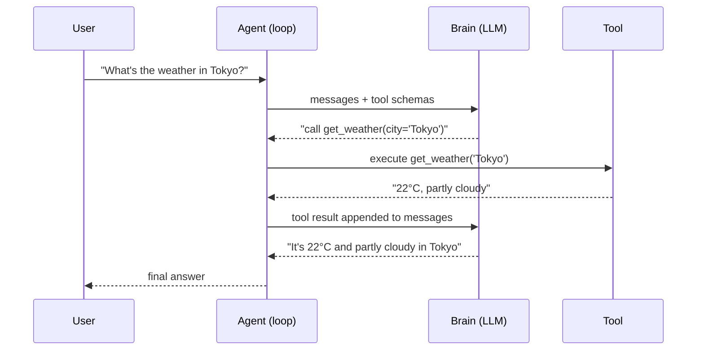
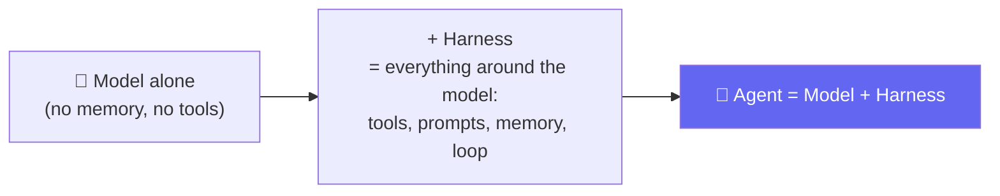
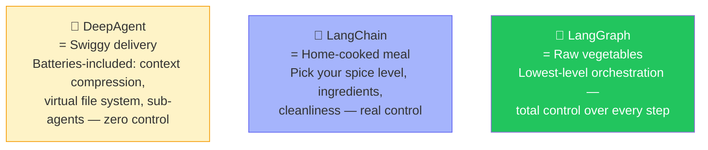
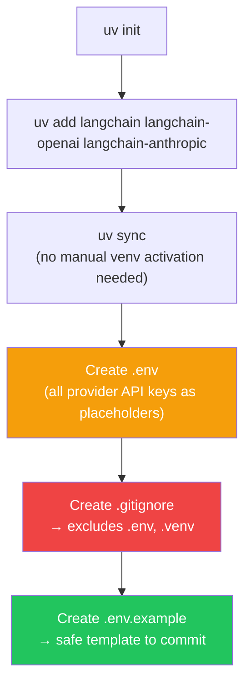
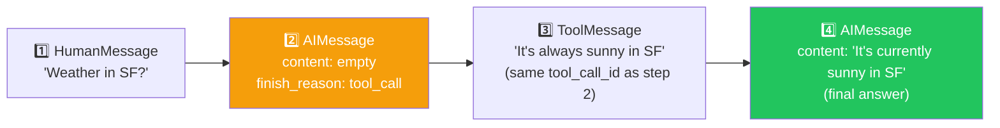
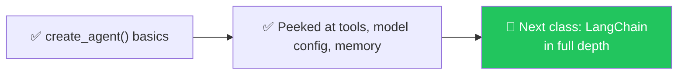

# 🔗 Class 6: LangChain Begins — From Raw Python to `create_agent()`
### 📋 Agentic AI 3.0 Specialization | Krish Naik Academy

**🎙️ Mentor:** Mayank Aggarwal
**⏱️ Duration:** ~4.5 hours | **📅 Session:** Day 6 (12 July 2026)

---

## 🔁 Quick Recap

- ✅ Model → Chatbot → Agent hierarchy, fully internalized.
- ✅ Two ways to access AI: **paid** (OpenAI, Anthropic) vs. **free/cheap** (Groq, OpenRouter) — both need an API key and credits/usage limits.
- 🎯 Yesterday's agent only let *you* call tools manually. Today's upgrade: **the agent calls tools itself**, in a loop, using the schema you gave it.

---

## 🛠️ Finishing the Pure-Python Agent — Tools Calling Themselves



> 🧠 **Sanity check posed to the class:** *"If ChatGPT told you 'go search Google yourself and paste the results back to me' — would that be useful? No. You'd never use ChatGPT again. The whole point of an agent is that IT calls the tool, not you."*

- The full loop was wrapped in a `run_agent(messages, max_turns=4)` function — `max_turns` caps how many times the loop can call the brain again, preventing runaway costs/infinite loops.
- 🔬 **Live proof of "no tool = no hallucinated call":** asked *"What is 1 USD in INR?"* with **no currency tool defined** → the model correctly gave a plain-text answer instead of inventing a tool call, because it had genuinely nothing to call.

---

## 🤔 Why LangChain? — The Swiggy / Home-Cooked / Vegetables Analogy

> *"We built agents in raw Python. We saw it works — but it doesn't scale long-term. That's exactly the gap a framework like LangChain fills."*



> **LangChain's own definition, read aloud:** *"Agent = model + harness. LangChain provides `create_agent`, a minimal, highly configurable harness — everything around the model loop: the prompts, the tools, and any middleware that shapes behavior."*

### 🍽️ Three Levels of Control


- **DeepAgent** → grab-and-go: automatic context compression, virtual file system, sub-agent spawning, built on top of LangChain agents. Zero control over internals.
- **LangChain** → "highly customizable harness, easily tailored to your use case and data." This is where the course starts.
- **LangGraph** → "low-level orchestration framework for advanced needs, combining deterministic and agentic workflows." Full control, steepest learning curve.
- **LangSmith** → separate tool, used for **monitoring/observability**, not agent-building itself.

> 💬 *"Since you're going to build real software, not toy demos — you need the level of control LangChain gives you. Deep Agent is great, but you can't customize the 'hygiene' of the food, same as Swiggy."*

> 📌 **Version note:** Everything before LangChain v1 is now called **"LangChain Classic."** Most YouTube tutorials still teach Classic — this course teaches the **latest version**.

---

## 💼 The Career Advice Detour

> *"No one actually cares how many frameworks you know. If, as a software developer, I can't control how slow my agent runs, my client will never accept my software. I deliberately build my own agents — or skip frameworks entirely — in real client work, even though I'm teaching you a framework here."*

- Mayank's stated credentials: Goldman Sachs interviewer, cleared interviews at Amazon and Uber, closed a $10K client engagement.
- 🎯 **The actual advice:** master the *fundamentals* (what you did in raw Python) — frameworks become trivial afterward, and depth is what actually gets you hired, not a long list of framework names on a resume.

---

## 🏗️ Setting Up a Real LangChain Project



- Installing just 3 packages (`langchain`, `langchain-openai`, `langchain-anthropic`) pulled in **~45 dependencies** — normal, since each provider integration has its own transitive requirements.
- 🔐 **Security habit reinforced live:** Mayank accidentally pushed a real API key earlier in the session, had to delete it — used as a real-time cautionary example for why `.gitignore` + `.env.example` matters.
- `pyproject.toml` already captures everything `requirements.txt` would — confirmed as the better modern approach.

---

## ⚡ `create_agent()` — LangChain's One-Liner

```python
from langchain.agents import create_agent

agent = create_agent(
    model="openai:gpt-4o-mini",     # or anthropic, groq, gemini, ollama...
    tools=[get_weather],
    system_prompt="You are a helpful weather assistant."
)

result = agent.invoke({"messages": [{"role": "user", "content": "Weather in San Francisco?"}]})
```

> *"This is quite literally the same weather agent we spent hours building by hand — just in a few lines. `agent.invoke()` runs the entire loop we wrote manually: check for tool call → execute → feed result back → repeat, all handled internally."*

- Model provider is swappable by just changing the string prefix — OpenAI, Anthropic, Gemini, Groq, Ollama, Azure, Bedrock, Hugging Face, Fireworks — **you always need your own API key regardless of provider.**
- Tools can be passed as **plain Python functions** — no need to hand-write a JSON schema like in the raw-Python version. LangChain infers structure from the function signature; the `@tool` decorator plus a **docstring** is what feeds the description to the model (upcoming topic, foreshadowed here).

### 🔬 Peeling Back the Convenience — What's Actually Happening
Printing the raw `result["messages"]` after an `agent.invoke()` call revealed exactly the same anatomy built by hand on Day 5:



- Each message carries `prompt_tokens` / `completion_tokens` / `total_tokens` — same token accounting concept from Day 4/5, just wrapped in LangChain's object format.
- 🔍 Confirmed live: this particular call ran the **agentic loop twice** — first an AI message triggering a tool call, then a second AI message using the tool's result to produce the final reply. Exactly matching the hand-built loop's mechanics.
- ⚠️ **Trade-off named explicitly:** *"With this convenience, you lose some visibility and fine control — you can't see the full tool list/schema as clearly as in the raw notebook, because LangChain infers most of it for you."*
- 🐢 **Why LangChain calls can feel slower:** extra wrapping — generating IDs, structuring messages, internal bookkeeping — adds real overhead your raw Python version didn't have.

---

## 🧩 First Look at Documentation-Driven Building (5-Step Guide)

LangChain's own quickstart walks through: **1)** detailed system prompt → **2)** create tools (`@tool` decorator on any function) → **3)** configure the model (`init_chat_model`, temperature, timeout, max_tokens) → **4)** add memory → **5)** assemble and run the agent.

### 🛠️ Tools via `@tool` Decorator
```python
from langchain.tools import tool

@tool
def fetch_text_from_url(url: str) -> str:
    """Fetch and return the text content of a web page."""
    # ...implementation...
    return text
```
- The decorator takes your plain function and wraps it into everything an agent needs to call it — no manual schema-writing required, unlike the raw-Python approach from Day 5.

### 💾 Memory — Local Run vs. Persistent
- 🔬 **Live demo:** sent `"Hi, I am Mayank"` then `"Who am I?"` in **two separate script runs** → agent had no idea, because that "memory" only exists while the Python process is actively running (in-memory list, gone once the script ends).
- Real persistence needs an explicit store: a database, a file, or a dedicated memory/checkpoint mechanism — flagged as a topic to go deeper into in an upcoming class.
- ⚠️ **On caching tool results — context matters, not a blanket rule:**
  - Stock prices → **never cache** (change every second)
  - Weather → cache for maybe a day (TTL = time-to-live)
  - Currency conversion → cache for maybe 10 minutes
  - *"Don't cache everything just because it's easy — think about how fast the underlying data actually changes."*

---

## 🗺️ What's Next



> *"This was the first framework — I want to go deep, because everything after this will build on it. Next class, full depth on LangChain."*

---

## 💬 Live Q&A Highlights

| Question | Answer |
|---|---|
| Do I need an API key just to use LangChain itself? | LangChain is just the harness — you still always need your own AI provider API key regardless |
| Can `create_agent` use Groq, Gemini, OpenRouter, Ollama? | Yes — any supported provider works, just swap the model string/config |
| Is the default loop count fixed across all frameworks? | No — it varies; some frameworks might cap it at 100 iterations. Mayank's own raw-Python version used 4 simply as a sane starting default |
| Does LangChain require writing a tool schema like the raw-Python version did? | No — pass a plain function (optionally decorated with `@tool`); LangChain infers the schema, using the docstring as the description |
| Should tool results always be cached for performance? | No — it depends entirely on how fast the underlying data changes (stock price ≠ weather ≠ currency rate) |
| Why does a LangChain agent feel slower than the raw Python version? | Extra internal overhead — ID generation, message structuring, bookkeeping around every call |

---

## ✅ Action Items After Class 6

- [ ] 🔁 Re-run all files from `python_and_agents` (Day 5) once more — LangChain will make far more sense once that foundation is automatic
- [ ] 🏗️ Set up a fresh `uv` project with `langchain`, `langchain-openai`, `langchain-anthropic` installed
- [ ] 🔐 Practice the `.env` + `.gitignore` + `.env.example` pattern — never let a real key hit GitHub
- [ ] ⚡ Build the weather agent using `create_agent()` yourself, then print `result["messages"]` and manually map each message back to the anatomy learned on Day 5
- [ ] 🛠️ Try wrapping one of your own Python functions with `@tool` and giving it a clear docstring
- [ ] 📖 Come back ready for **LangChain in full depth** next class

---

*📝 Notes compiled from the full Class 6 transcript — "LangChain Begins: From Raw Python to create_agent()," Agentic AI 3.0 Specialization, Krish Naik Academy.*
