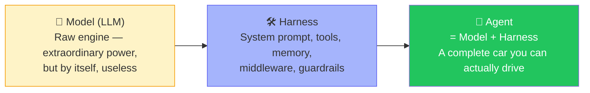
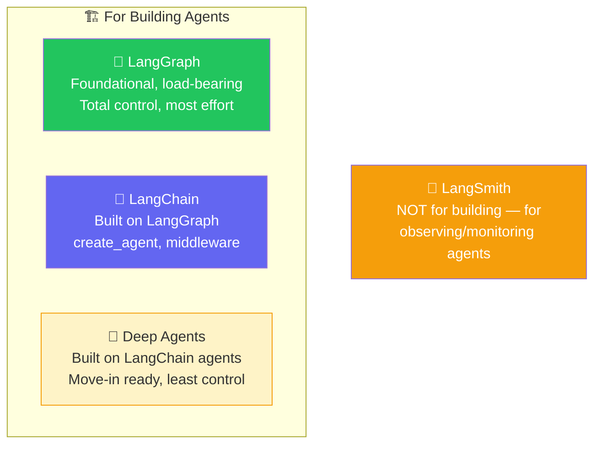
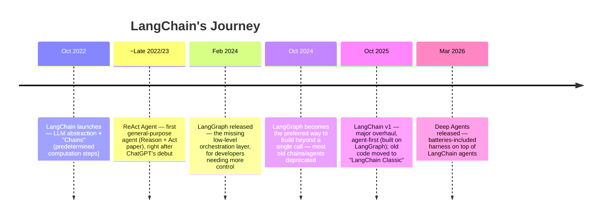
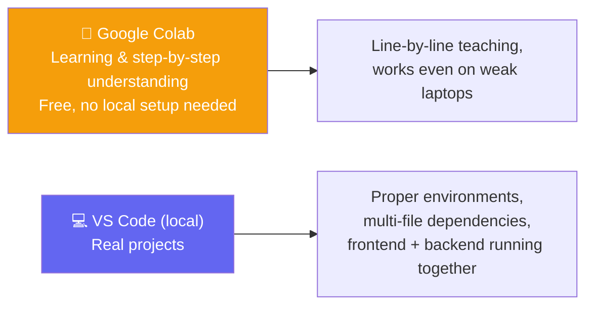
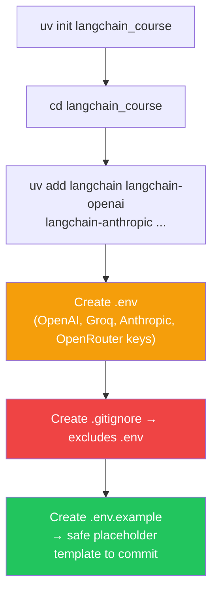
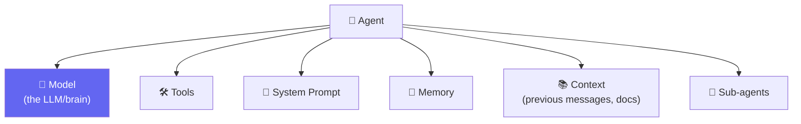
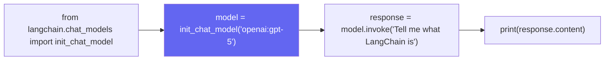
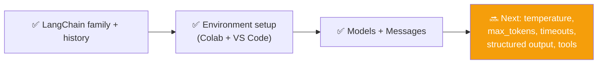

# 🚗 Class 7: The LangChain Family, Harness Engineering & First Models
### 📋 Agentic AI 3.0 Specialization | Krish Naik Academy

**🎙️ Mentor:** Mayank Aggarwal
**⏱️ Duration:** ~4.5 hours | **📅 Session:** Day 7 (18/19 July 2026)

---

## 🎯 The Goal for This Multi-Class Arc

> *"Rather than rushing or jumping around, we're going to build a very, very strong base — one we can stand on for every framework after this."*

LangChain will be taught **in real depth over 3–4 classes**, because it's the foundation every other framework in this course (LangGraph, ADK, AutoGen, Amazon's Agent SDK) will be compared against.

> 🧠 **Language analogy:** *"Once you understand one language in depth — grammar, nouns, punctuation — every other language becomes easier to pick up. Same with frameworks: master LangChain deeply, and LangGraph, CrewAI, ADK all become fast to learn."*

📚 **Study format introduced:** the **Pomodoro Technique** — 15–20 min focused teaching blocks, then a short break, repeated throughout class.

---

## 🚙 The Big Analogy: Model = Engine, Agent = Car, LangChain = Harness



> *"The model is the raw engine — the brain. It has extraordinary power, can reason about almost anything. But without a harness, it has no idea what tools exist, it's completely stuck, it can't go anywhere by itself. Even Claude Code and ChatGPT are, at their core, this same brain wrapped in connectors, skills, memory, and web search — harnessed."*

- 🎯 **"Harness Engineering"** — a term getting popular right now — is exactly this: how well you wrap a raw model with the right system prompt, tools, middleware, guardrails, and checkpoints so it becomes genuinely useful.
- LangChain's own philosophy: *"LLMs are even better when combined with external sources of data — tools and other data."*

---

## 🏠 The LangChain Family — Four Offerings



> ⚠️ **Common mix-up cleared:** **LangFuse** is *not* part of the LangChain family — it just happens to share "Lang" in the name. It's an independent, open-source observability platform.

### 🍽️ Why Start With LangChain (Not Deep Agents)?
> *"Starting directly with Deep Agents would mean starting a job as a chef but only knowing how to order from Swiggy or Zomato. You'd get food, but zero control. LangChain is like a kitchen — you control the spice level, the ingredients, the cleanliness. LangGraph goes even lower — you're controlling which vegetables to even buy."*

- **Deep Agents** = "batteries included" — automatic context compression, virtual file system, sub-agent spawning, but far less configurability. *"Move-in ready — just connect the battery."*
- **LangChain** = the course's starting point: real customization without needing to hand-build every primitive.
- **LangGraph** = true low-level orchestration for when deterministic + agentic workflows must be tightly controlled (streaming, durable execution, short/long-term memory, human-in-the-loop — HITL).
- 📌 Intended mastery order: **LangChain → LangGraph → Deep Agents** (Deep Agents becomes trivial once the other two are solid, since it's built on top of them).

### 🔭 LangSmith — The Flight's Black Box
> *"We can't just read agent code to know what it did — we need its trace. Like a flight's black box: when the model was called, when a tool was called, what happened in the middleware, and how it all ended."*

An agent's lifecycle involves calling the LLM, checking memory, invoking tools, and interacting with a user — LangSmith lets you observe all of it after the fact (tokens used, time taken, where it failed), similar to how logging helps debug regular code.

---

## 📜 The LangChain Timeline — How Fast This Field Moves



> 💬 *"Old 'Chains' were like a fixed workflow: prompt → node → node → node. Then ReAct gave us agents that could actually reason and act — which is still the shape of most real applications today."*

- **Low-level vs. high-level, explained through real life:** *"The lowest level is where you have the most control — like everything on your desk, you can control directly. A low-level language provides little to no abstraction; it maps closer to the hardware, giving you precise manual control."* This is exactly why LangGraph (low-level) offers more control than LangChain.
- ⚠️ **Version warning:** most YouTube tutorials and blog posts still teach **LangChain Classic** (pre-v1). This course teaches **v1.0+ only** — old code still runs, but it's now legacy and unmaintained, "just like an iPhone 3 still charges, but nobody's fixing bugs in it anymore."

---

## 🖥️ How This Course Will Run Code Going Forward



> *"Colab notebooks are the best way to learn line by line, regardless of your laptop's specs. But real projects — with multiple dependent files and a frontend — happen in VS Code."* All notebooks are also pushed to GitHub for reference; **don't code along live** — watch, then practice using the recording.

---

## 🏗️ Setting Up a Real LangChain Project (VS Code)



- `pyproject.toml` tracks everything needed — a `requirements.txt` is optional/legacy-style, not required.
- 🔬 **Live debug demoed:** a notebook initially failed to read `.env` because the wrong Python interpreter/kernel was selected in VS Code — fixed by explicitly selecting the project's own `.venv` interpreter.
- Loading keys: `load_dotenv()` then `os.environ.get("OPENAI_API_KEY")` — confirmed working by printing just the first 5 characters (never the full key) as a safe sanity check.
- 🔐 **In Colab specifically:** use the built-in **Secrets** manager (🔑 icon) instead of hardcoding a key in a cell — same safety principle as `.env` locally.
- ⚙️ **Alternative key-setting method shown:** `import os; os.environ["OPENAI_API_KEY"] = "..."` — works, but `.env` + `load_dotenv()` is the safer, reusable pattern.

### 🔬 Sanity Check — Confirming the Whole Setup Works
```python
from langchain.agents import create_agent

def get_weather(city: str) -> str:
    """Get the weather for a given city."""
    return f"It's always sunny in {city}"

agent = create_agent(
    model="openai:gpt-5.5",
    tools=[get_weather],
    system_prompt="You are a helpful assistant."
)
agent.invoke({"messages": [{"role": "user", "content": "Weather in SF?"}]})
```
> *"If this runs on both Colab and VS Code, your entire environment is correctly wired — same code works whether you're on a personal laptop or an office machine."*

---

## 🧩 Agent = Model + Harness — Now With Named Components



> *"Tomorrow, don't come to me saying 'Mayank, I used Haiku but expected the smartest agent alive.' If you wanted that, you should've used Fable/Opus. The capability of your agent will always depend on the brain you chose."*

- LangChain's `create_agent` officially exposes: **model, tools, system prompt, structured output, invocation, streaming output**, and harness configuration — each will get its own deep-dive session.
- 🔑 **Key resolution behavior confirmed live:** setting `OPENAI_API_KEY` in the environment lets LangChain auto-detect and use it — LangChain expects **exact standard variable names** per provider (`OPENAI_API_KEY`, `ANTHROPIC_API_KEY`, etc.). Renaming it (`OPENAI_API_KEY_2`) or swapping providers without the matching env var name produces an authentication error — demoed live by intentionally switching to Claude Sonnet without setting `ANTHROPIC_API_KEY`.

---

## 🧠 Diving Into "Model" — The First Deep-Dive Component



- `init_chat_model` is LangChain's universal entry point — swap the provider string and the rest of the code stays identical. This is the core value proposition: *"Without LangChain, you'd write completely different code to connect to OpenAI vs. Claude vs. Groq vs. OpenRouter — LangChain harnesses all of that into one consistent interface."*
- Every model supports a different mix of capabilities — **tool calling, structured output, multimodality (text+image), reasoning** — and this varies by provider/model. Demoed live by literally asking ChatGPT to summarize a specific model's capability sheet (tool calling ✅, structured output ✅, multimodal ✅, reasoning present but weaker than flagship models).
- 🌍 Not just LangChain: shown that **CrewAI's documentation** uses the exact same "give me any LLM — Perplexity, Mistral, Anthropic" pattern, reinforcing why understanding this deeply in LangChain first pays off across every future framework in the course.

### 💬 Message Types — System, Human, (and Assistant)
```python
from langchain_core.messages import SystemMessage, HumanMessage

messages = [
    SystemMessage(content="You are a pirate. Answer everything in pirate language."),
    HumanMessage(content="What is the capital of France?")
]

response = model.invoke(messages)
print(response.content)
```
> 🔬 **Live proof:** running this produced a genuinely pirate-flavored answer — a fun, concrete demonstration that the system message actually steers behavior, consistent with the system/user/assistant roles taught back on Day 5.

---

## 📖 Open vs. Closed Source — Quick Clarification

| | 🔓 Open Source | 🔒 Closed Source |
|---|---|---|
| Access to weights/parameters | ✅ Yes — can self-host, fine-tune | ❌ No — never provided |
| Hosting | Can run on your own infrastructure | Must use via the provider's API only |
| Cost model | Often free or self-hosted cost only | Pay the company per use |
| Fine-tuning | Possible | Not possible |

> Example given: recent GPT-OSS / GPT-OSS-Safeguard releases are open-weight; most flagship models (GPT-5.x, Claude) remain closed-source, API-only.

---

## ⏸️ Where This Class Left Off

> *"I planned to cover Models and Messages today — we've done that. We'll continue with temperature, max tokens, and API timeout next class."*



---

## 💬 Live Q&A Highlights

| Question | Answer |
|---|---|
| Is LangChain foundational, and is LangGraph built on top of it? | No — it's the other way around: **LangGraph is the foundation**; LangChain is built on top of LangGraph |
| Does LangChain cost anything to use? | No — LangChain itself is free; you only pay your model provider (OpenAI, Anthropic, etc.) |
| Is LangChain still widely used in production? | Yes |
| Does LangChain offer official support if something breaks in our implementation? | No — same as Python itself: open a GitHub issue if it's a genuine bug, but there's no dedicated support unless your company has a contract with them |
| Can we use multiple models and compare their outputs? | Yes, absolutely — that's a common workflow |
| Which is "better," Anthropic or OpenAI? | Doesn't matter in the abstract — depends entirely on your use case, budget, and needs |
| Should a real project use paid or free models? | Depends on the project's requirements and budget — no universal answer |
| Does `ChatModel` automatically sort/manage chat history? | No — it does nothing extra for you by default; history management is still on you |

---

## ✅ Action Items After Class 7

- [ ] 🏗️ Set up a fresh `uv`-based LangChain project locally (`.env`, `.gitignore`, `.env.example`)
- [ ] 🔬 Run the `create_agent` sanity check on both Colab and VS Code — confirm both work identically
- [ ] 🧠 Practice `init_chat_model` with at least two different providers (e.g. OpenAI + one free option like OpenRouter/Groq)
- [ ] 💬 Try `SystemMessage` + `HumanMessage` with a fun persona (like the pirate example) to see the system prompt's effect firsthand
- [ ] 📖 Look up the capability sheet (tool calling, structured output, multimodality) for the model you plan to use most
- [ ] 🔁 Revise open vs. closed source distinctions before next class
- [ ] 📅 Come back ready for: **temperature, max tokens, API timeouts, structured output, and tools** — picking up exactly where this class left off

---

*📝 Notes compiled from the full Class 7 transcript — "The LangChain Family, Harness Engineering & First Models," Agentic AI 3.0 Specialization, Krish Naik Academy.*
