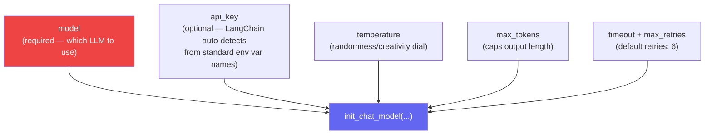
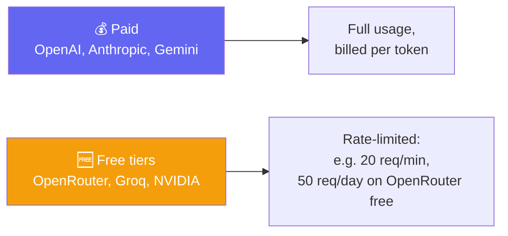
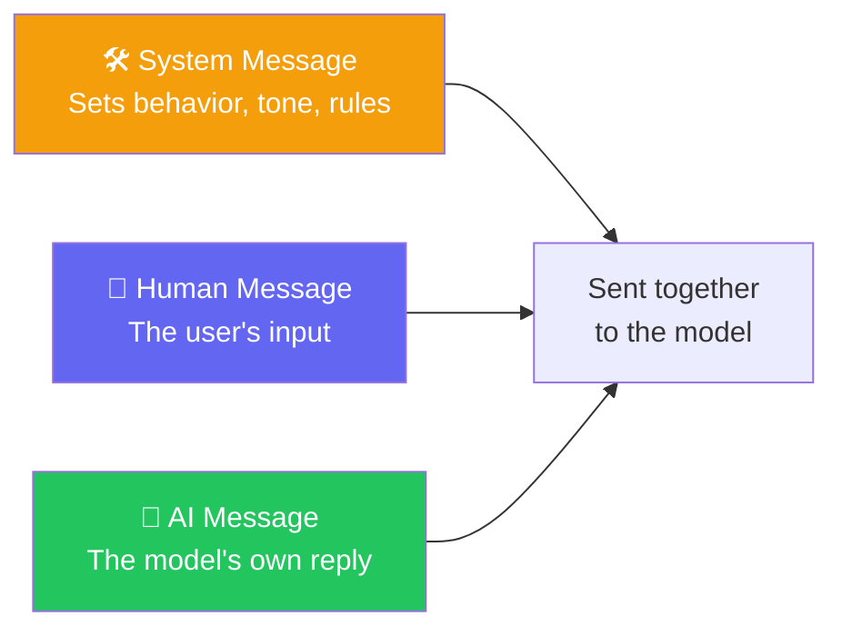
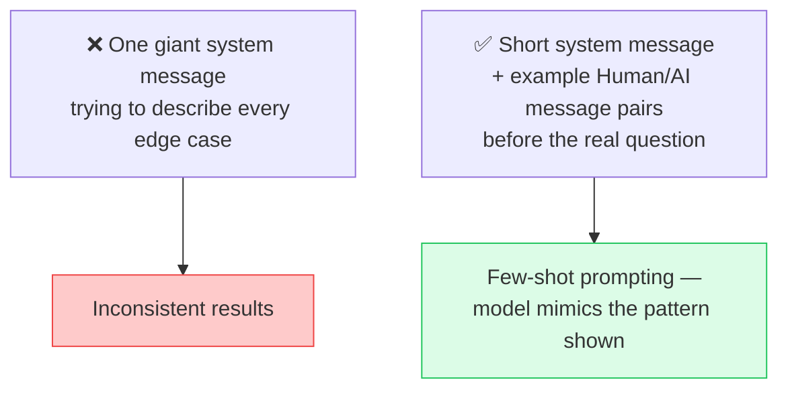
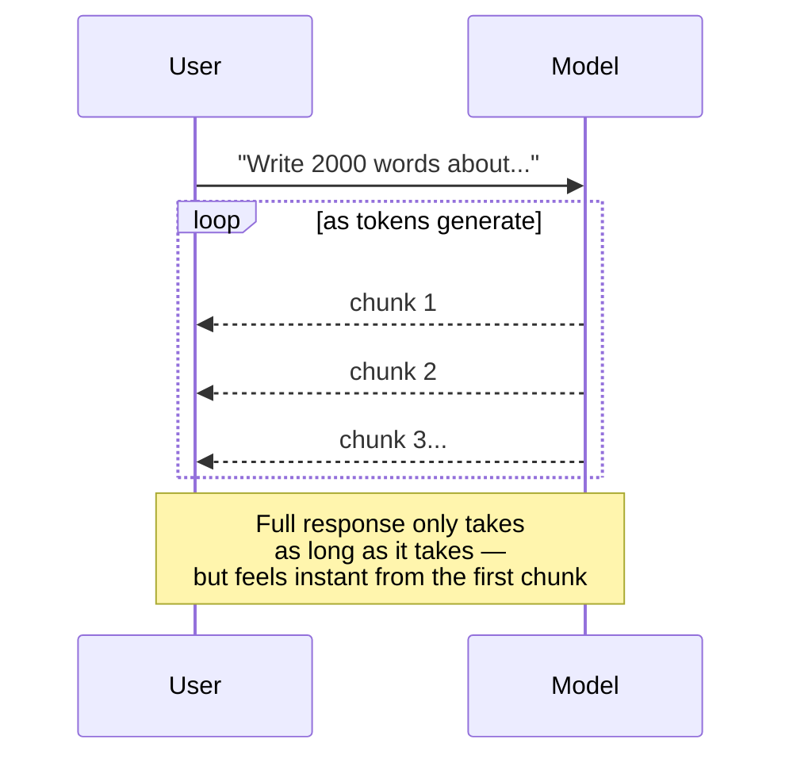
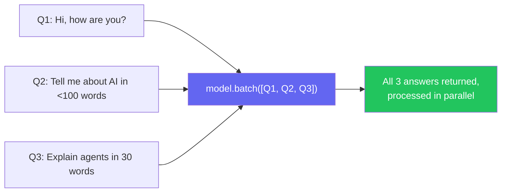
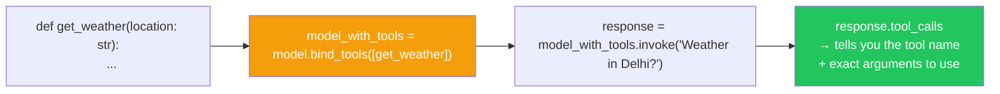
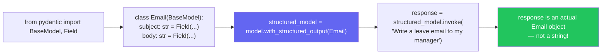

# 🧠 Class 8: Inside the Model — Parameters, Streaming, Tools & Structured Output
### 📋 Agentic AI 3.0 Specialization | Krish Naik Academy

**🎙️ Mentor:** Mayank Aggarwal
**⏱️ Duration:** ~4.5 hours | **📅 Session:** Day 8 (19 July 2026)

---

## 🔁 Quick Recap

- ✅ **Agent = Model + Harness** — reinforced with a pop quiz: *is Claude's web app "AI" or "an agent"?* Correctly identified as an **agent**, since it has memory and can use multiple tools — the base model is just one part of it.
- ✅ LangChain family (LangGraph, LangChain, Deep Agents, LangSmith) and the version history from Class 7.
- 🎯 Mayank explained that he is deliberately spending this much time on LangChain because, in his experience, **no other course teaches the current v1.0+ version in this much depth** — most available material still covers the older "Classic" version.

---

## 🧭 Framing: Going Deep vs. "5-Minute LangChain" Tutorials

> Mayank drew a clear line between two types of learners: those who stop at the quickstart — happy that `create_agent()` works — versus those who actually understand every feature LangChain exposes around a model. He was explicit that this course is aiming for the second kind, because superficial familiarity doesn't hold up once real, complex use cases show up on the job.

---

## ⚙️ Model Parameters — What Actually Goes Into `init_chat_model`



- **`model`** is the only truly required field.
- **`api_key`** isn't required as a parameter because LangChain assumes the standard environment variable is already set (`OPENAI_API_KEY`, `ANTHROPIC_API_KEY`, etc.) — matching what was demonstrated in Class 7.
- **`max_tokens`** directly controls output length — flagged as the fix for a very common OpenRouter error where a response exceeds the allowed limit (adjusting `max_tokens` upward resolves it).
- **`timeout`** and **`max_retries`** (default: 6) manage how long and how persistently LangChain waits on a model response before giving up.
- These get passed as **keyword arguments** — explicit `key=value` pairs sent alongside the model name.

---

## 🌍 Free vs. Paid Models — Recap With Real Limits Shown



- Live-demoed hitting OpenRouter's **free-tier rate limit** directly — confirmed the caps really do apply even for lightweight testing.
- **Groq** was clarified again: it hosts mostly **open-source models**, and Groq itself pays for and manages the hosting infrastructure — that's the trade being made in exchange for free/cheap access.
- 💬 The "free lunch" reality check: free models generally trail Anthropic/OpenAI flagship quality — that gap is the cost of not paying.

---

## 💬 Message Types Recap + A Real Debugging Story



- 🔬 **Live proof, revisited:** sending a single "hi" to Claude actually transmits **thousands of tokens** once the hidden system message is included — confirmed again this session to hammer the point home.
- ⚠️ **Important distinction:** in a finished product like Claude's own web app, the system message is **fixed by the provider** and cannot be changed by the end user. When building a custom agent, the developer controls and can freely edit that system message — that's the whole point of building your own harness rather than just using someone else's chat app.

### 📖 Mayank's Own Debugging Story — Why Message History Beats a Bloated System Prompt
> Mayank shared a real experience from earlier in his career, building a co-pilot-style chatbot application. He noticed the assistant wasn't performing well even with a solid system message. Rather than continuing to pile more instructions into that one system message, he restructured the conversation by inserting a few example exchanges as **separate prior messages** — alternating a sample user message with a sample AI reply — *before* the real user's question. The model's output improved noticeably once it had those example turns to anchor its behavior, rather than relying purely on a written instruction.
>
> A senior colleague, several years more experienced, asked how the issue had been fixed — and the explanation was exactly this: instead of bulking up the system message, a short example conversation was fed in ahead of time. This technique is formally known as **few-shot prompting**.



```python
from langchain_core.messages import SystemMessage, HumanMessage, AIMessage

messages = [
    SystemMessage(content="You are a helpful support assistant."),
    HumanMessage(content="Example question..."),
    AIMessage(content="Example ideal answer..."),
    HumanMessage(content="Actual user question here"),
]
response = model.invoke(messages)
```

> 💡 Messages can also be passed as plain **dictionaries** with a `role` key (`role: "system"`, `role: "user"`, `role: "assistant"`) instead of the dedicated message classes — both work identically. Mayank noted he personally prefers the class-based approach for readability, though there's no functional advantage either way.

---

## 🧬 Anatomy of an AI Message

When a model responds, the object returned carries far more than just the reply text: the **text content**, a **content block**, an **ID**, and — when relevant — **tool call** information. Understanding this full shape matters because later features (streaming, structured output, tool calling) all build on reading these fields correctly rather than just the final text.

---

## 📡 Streaming — Why "Feels Fast" Matters More Than "Is Fast"

> **The demo that made it click:** asking ChatGPT to write a 2,000-word passage takes roughly 5–7 seconds to fully generate — but the text visibly appears piece by piece rather than all at once at the end. That progressive appearance *is* streaming, and it's the reason the wait doesn't feel as long as it actually is.



```python
for chunk in model.stream("Why do parrots have colorful feathers?"):
    print(chunk.text, end="", flush=True)
```

- Framed as directly relevant to real product work: if building something for a company like Amazon or Swiggy, user experience matters — no one would want to ship a UI that just sits frozen for 7 seconds.
- No extra library installation needed — streaming is built into the model call itself; just swap `.invoke()` for `.stream()`.
- Collecting streamed chunks into one final message typically requires accumulating them in a loop (similar to how ChatGPT's own UI progressively renders and finalizes a full answer).

---

## 📦 Batching — Solving the "Too Many Questions" Problem

> **The scenario posed:** imagine being an AI developer at a company that receives a constant stream of questions to answer. Calling the AI one question at a time — ask, wait, ask, wait, ask, wait — is slow and needlessly expensive compared to sending several independent questions together.



```python
responses = model.batch([Q1, Q2, Q3])
for response in responses:
    print(response)
```

- Batching requests must be **independent** of each other — this is what allows them to run in parallel.
- By default, `.batch()` waits for and returns **everything at once**. For a progressive alternative, `batch_as_completed()` returns each answer as soon as it individually finishes, rather than waiting for the slowest one to catch up.
- Practical framing given: a company's Q&A portal doesn't need to hit the AI instantly per question — it could **collect requests over a short window** (e.g. every 15 seconds or every minute) and batch them, cutting cost and improving throughput.
- 📌 **Three ways to call a model, now fully covered:** `.invoke()` (single call), `.stream()` (progressive output), `.batch()` (parallel, independent requests) — and yes, batching and streaming can be combined (`batch_as_completed`) for the best of both.

---

## 🛠️ Tool Binding — How a Model Learns What It Can Call

> **The core idea:** a raw model has no built-in awareness of any function in the codebase — it can't magically know a `get_weather()` function exists just because it's sitting in the same file. **Binding** is the explicit act of telling the model, *"here is the list of tools available to you, and here's what each one does."* Once bound, the model can reference those tools in its replies — but binding itself does not connect the model to live execution; it only makes the model *aware*.



```python
def get_weather(location: str) -> str:
    """Get the current weather at a given location."""
    return f"It's sunny in {location}"

# Step 1: bind the tool(s) to the model — just makes the model aware they exist
model_with_tools = model.bind_tools([get_weather])

# Step 2: invoke as usual — the model decides whether a tool is needed
response = model_with_tools.invoke("What is the weather in Delhi?")

# Step 3: inspect what the model decided
print(response.tool_calls)
# → [{'name': 'get_weather', 'args': {'location': 'Delhi'}, 'id': '...'}]
```

- 🔑 **Crucial clarification repeated for emphasis:** calling `.invoke()` after binding tools does **not** execute the tool. It only asks the model to decide *whether* and *how* it would call a tool — the actual function still has to be run separately by the developer's own code. This mirrors exactly the manual agentic loop built back on Day 5/6.
- 🧩 **Breaking down what actually happens on `.invoke()`:** the model reads the user's message alongside the schemas of every bound tool, and decides one of two things — reply directly in plain text, or respond with a **tool call** instruction instead of content. When it chooses the latter, `response.content` comes back **empty**, and all the useful information — which tool to call, and with what arguments — lives in `response.tool_calls` instead. This was demonstrated live: asking about Delhi's weather returned an empty `content` field, with the tool name and the `location: "Delhi"` argument populated in `tool_calls`.
- 🔁 **Why the developer still has to do the calling:** binding only gets the model to *decide*. The actual next step — reading `response.tool_calls`, calling `get_weather("Delhi")` in real Python, capturing its return value, and feeding that result back to the model as a new message — is exactly the loop built by hand back on Day 5/6. `create_agent()` automates this whole cycle, but binding on its own does not.
- **LangChain's convenience:** a plain Python function can be bound directly — no manual JSON schema required, unlike the raw vanilla approach. LangChain's `ChatOpenAI` wrapper (not a bare OpenAI SDK object) is what enables this — confirmed by inspecting the object's metadata, which shows LangChain-specific fields layered on top of the underlying OpenAI response.
- ⚠️ A **docstring is still important** — a tool defined without one risks the model guessing its purpose incorrectly, exactly as covered when tool schemas were first introduced.
- 🧪 **Multiple tools, same pattern:** binding accepts a list, so a second tool (e.g. a `set_password(new_pass: str)` function demoed live) can be added to the same `bind_tools([...])` call — the model then picks whichever tool actually matches the user's request, based on each tool's name and docstring.

---

## 📐 Structured Output — Pydantic Meets the Model

> **The connecting question posed to the room:** given everything already learned about Pydantic's field and data validation — shouldn't a model be able to reply in that same structured, validated shape, instead of free text?



```python
from pydantic import BaseModel, Field

class Email(BaseModel):
    subject: str = Field(description="The email subject line")
    body: str = Field(description="The email body")

structured_model = model.with_structured_output(Email)
response = structured_model.invoke("Write a leave email to my manager")

print(type(response))  # <class '__main__.Email'>
```

> 🎯 **Why this matters downstream:** if an application's logic depends on getting an `Email` object back, it will never unexpectedly fail on a malformed string — the model itself is now constrained to reply in exactly that shape. This directly connects back to the Pydantic deep-dive from Class 3.

---

## 🧩 The Big-Picture Realization

> By this point, Mayank tied everything together: everyone can technically "use a model" with a five-minute tutorial — but real engineering means understanding every knob LangChain exposes around that model: **input types (messages), parameters (temperature, max_tokens), tools, and structured output.** The system prompt, the tools, and the model itself are all quietly connected behind the scenes by LangChain — and the course's job is to make sure none of that stays a black box.

---

## 💬 Live Q&A Highlights

### During the Teaching Flow

| Question | Answer |
|---|---|
| Does `create_agent` call a tool in a single `invoke`? | Normally yes — by default it resolves within a single invoke call |
| Can the system message be changed if a different LLM is used? | Yes, the system message can be changed regardless of which model is behind it |
| Is a system message the same as a "skill"? | No — they are different concepts |
| Any advantage to using message dictionaries over message classes? | No functional advantage; Mayank personally prefers the class-based approach for clarity |
| Does batching increase latency? | Only if waiting for the entire batch to finish; using `batch_as_completed` avoids that |
| Can streaming and batching be combined? | Yes — `batch_as_completed` effectively streams results as each individual item in the batch finishes |

### Extended Doubt-Clearing Session (End of Class)

**🔧 Manually resolving a tool call — the full walkthrough**
A learner asked Mayank to demonstrate, step by step, what happens between the model saying "call this tool" and the final answer coming back. Mayank live-coded it:
- When the AI decides a tool is needed, `response.content` comes back **empty** — the actual instruction lives in `response.tool_calls`, which includes the tool's **name**, its **arguments**, and a unique **ID**.
- The developer then manually looks up and calls the real Python function using those extracted arguments (e.g. `get_weather(location=...)`) — this step is *not* automatic just because a tool was bound.
- The function's return value (a plain string, in this case) then has to be wrapped and sent back as a **`ToolMessage`** — not just appended as a plain string — because `ToolMessage` explicitly carries the `content` (the tool's result) alongside the same `tool_call_id` the AI originally issued, so the model can match the answer back to its own request.
- Mayank noted `ToolMessage` supports more than just `content` and `tool_call_id` — it can also carry an **`artifact`** field (for richer tool output than a plain string) and a **`status`** field (success/failure), which become useful for building observability/tracing into a real production agent later.

**💰 Does batching actually save tokens, or something else?**
A learner pushed hard on whether batching 3 questions together avoids resending the system message 3 times. Mayank's answer, after thinking it through live:
- **No — tokens are not saved.** Every individual request inside a batch still carries its own full system message and context; batching does not merge them into one shared payload.
- **What actually gets saved is cost and time**, and it comes from two separate places: (1) **provider-side batch APIs** (e.g. OpenAI's batch endpoint processes jobs asynchronously at roughly 50% lower cost — a pricing decision made by the provider, not a token-reduction trick), and (2) **infrastructure savings** — fewer round trips, handshakes, and connections when grouping 1 million individual calls down into far fewer batched calls.

**🌐 Confirming everything really is "just an API call" underneath**
A follow-up question asked whether every AI call — regardless of whether it goes through raw Python, LangChain, or any other framework — is fundamentally a standard API request (method, parameters, body) and a standard API response. Mayank confirmed **yes across the board**: LangChain, OpenRouter, Claude, and the raw `chat.completions` calls built by hand back on Day 5/6 are all, underneath, the same kind of API request/response — nothing magical is added by any framework layer.

**🧭 Routing a query to the right agent among several specialized agents**
A learner described a real system: a general-purpose chatbot with 4–5 specialized agents behind it, each backed by a large Markdown knowledge file, and asked how to decide which agent should handle an incoming query without sending every agent's full file on every request. Mayank's guidance:
- Treat each agent like a **tool** — give the routing step only a short **name + description** for each agent, not their entire underlying files.
- The routing decision itself can be as simple as an `if` statement or as sophisticated as a small dedicated LLM call whose only job is classification — the right choice depends on how distinctive and non-overlapping the agents' domains are.
- If agent descriptions are themselves too large to route efficiently, Mayank suggested treating that as its own retrieval problem (i.e., a smaller RAG-style lookup just for agent metadata) rather than stuffing everything into the routing prompt.

**📝 Managing context across a multi-day, multi-session build (memory.md pattern)**
Another learner asked how to avoid re-sending an entire project's context every day when building something incrementally over weeks. Mayank's suggested pattern:
- Maintain a running summary file (e.g. `memory.md` / `history.md`) that gets updated by the AI itself after each session, rather than resending the full raw history every time.
- On the next session, only that summary file needs to be read back in — dramatically cutting token usage compared to replaying the entire prior conversation.
- ⚠️ Honest trade-off flagged directly: summarizing to save tokens *can* lose detail if the underlying project is complex enough — full context and minimal tokens can't both be maximized at once. Mayank noted this is exactly why **human oversight** remains necessary rather than assuming full automation is safe.

**(Bonus, off-topic)** Tips for freelancing as an AI engineer? Experience and genuinely solid skills matter more than aggressive marketing; starting on platforms like Upwork at an individual level was Mayank's own path in — quality of delivered work is what sustainably brings in clients.

---

## ✅ Action Items After Class 8

- [ ] ⚙️ Practice setting `temperature`, `max_tokens`, `timeout`, and `max_retries` explicitly on a model and observe the differences
- [ ] 💬 Recreate the few-shot prompting pattern: system message + example Human/AI pairs + real question — compare output quality against a plain system-message-only version
- [ ] 📡 Try `.stream()` on a long-form prompt and print chunks as they arrive
- [ ] 📦 Try `.batch()` with 3 independent questions, then try `batch_as_completed()` and compare the experience
- [ ] 🛠️ Practice `bind_tools()` on a simple function, call `.invoke()`, and inspect `response.tool_calls` — remember, the tool itself is *not* actually executed yet at this stage
- [ ] 📐 Define a Pydantic model and use `with_structured_output()` to get a real typed object back instead of a string
- [ ] 🔁 Revise all message types (System, Human, AI) and the AI message anatomy before next class — Mayank was explicit that repeated confusion on these basics will slow the whole group down

---

*📝 Notes compiled from the full Class 8 transcript — "Inside the Model: Parameters, Streaming, Tools & Structured Output," Agentic AI 3.0 Specialization, Krish Naik Academy.*
