# 👥 Class 25: Multi-Agent Patterns in LangChain — Subagents, Handoffs, Skills & Router
### 📋 Agentic AI 3.0 Specialization | Krish Naik Academy

**🎙️ Mentor:** Mayank Aggarwal
**⏱️ Duration:** ~4 hours | **📅 Session:** Day 25 (4 October 2026)

---

## 📰 Quick Updates

- 📓 **The notebooks were the class text.** The class worked through the multi-agent notebooks from the shared *Weekend 14* folder (`00_Multi_Agent_Overview` and the four project notebooks for subagents, handoffs, router, and skills). Mayank had asked everyone to read them beforehand and opened by asking who had, and what they thought.
- 🎯 **Today's scope:** go deep on *why* the five LangChain patterns differ, run each one, and clear up the confusion between them, since "what's the difference between a router and a handoff?" is a standard interview question. The **Meridian AI** project overview closed the session.
- 🗺️ **Roadmap:** next class starts the Meridian AI project (GCP, FastAPI, Gemini, RAG basics as needed). **A2A** and **RAG** are still to come, with observability and evaluation covered through the projects.
- 🩹 Small housekeeping: the class began with audio-volume and screen-lag troubleshooting; a Python course video failed to upload to YouTube (file-size error) and was being re-attempted; and Udemy coupons plus a request for ratings were shared at the end.

---

## 🧠 Why Multi-Agent at All?

A single agent with every tool and every instruction in one prompt works fine until it doesn't: the model has to pick between a dozen similar-looking tools, hold unrelated domains in one context window, and follow one prompt that tries to cover every situation. Multi-agent architectures split that single agent into focused pieces and compose them back together.

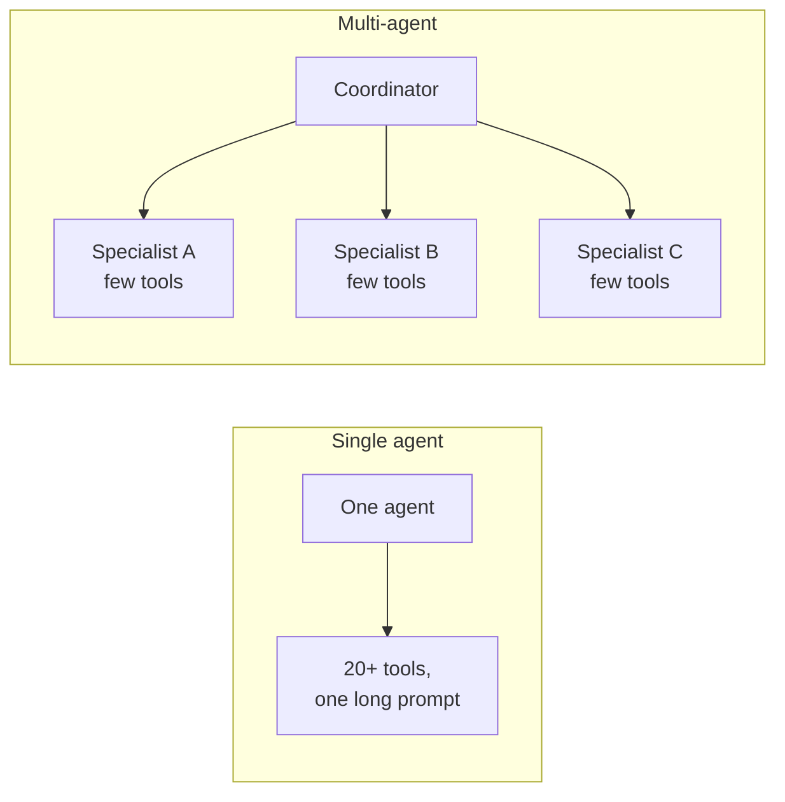

The reasons to accept the extra complexity, straight from the notebook: **context management** (specialized knowledge without overwhelming one window), **distributed development** (different teams own different capabilities), and **parallelization** (specialized workers run concurrently). LangChain v1's core idea still applies: **an agent is a model plus a harness**, and a multi-agent system is just several of those agent objects wired together in one of a few well-understood shapes.

Mayank was candid about one thing up front: LangChain makes the *implementation* of some of these patterns harder than other frameworks do. Other frameworks handle more of the wiring themselves; in LangChain, you build more of it yourself with state and middleware. The concepts are identical either way, and LangGraph, coming later, gives even more control.

### Just Having Several Agents Isn't "Multi-Agent"

A recurring warning: **defining three agents doesn't make a multi-agent system.** It only becomes one once something wires them into a workflow. Anyone can copy code that defines three agents, and most people would wrongly call it multi-agent. The distinction between patterns is what an interviewer will probe next.

---

## 🧩 The Five Patterns at a Glance

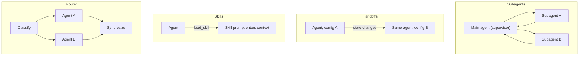

| Pattern | Core mechanism | Best fit |
|---|---|---|
| **Subagents** | A supervisor agent calls other agents *as tools* | Distinct domains, each with its own tools and prompt, under centralized control |
| **Handoffs** | One agent's prompt and tools change based on **state** | A sequential workflow where behavior should change as it progresses |
| **Skills** | One agent loads specialized prompt content *on demand* | Many possible specializations, loaded only when needed to keep context small |
| **Router** | A classification step fans out to specialized agents in parallel, then synthesizes | Distinct knowledge *verticals* queried independently and combined |
| **Custom workflow** | A hand-built LangGraph graph, any shape | Anything the other four don't fit; taught with LangGraph |

Everything here can be combined: a subagent can use skills internally, a router can sit behind a conversational agent, a custom workflow can embed any of them.

---

## 1️⃣ Subagents: An Agent Used as a Tool

The first pattern is the one closest to what was shown last class with Claude spawning a sub-agent: a supervisor calls other agents as if they were tools. A subagent can have its own model, its own tools, and, importantly, its **own separate context**.

### The Code (Booking Specialist and Supervisor)

```python
from langchain.tools import tool
from langchain.agents import create_agent

@tool
def check_seat_availability(showtime: str) -> str:
    """Check how many seats are left for a showtime."""
    return f"{showtime}: 12 seats remaining in Screen 3."

booking_specialist = create_agent(
    model,
    tools=[check_seat_availability],
    system_prompt="You are a booking specialist. Use your tool to answer seat questions.",
)

@tool
def handle_booking_question(request: str) -> str:
    """Delegate a booking-related question to the booking specialist."""
    result = booking_specialist.invoke({"messages": [{"role": "user", "content": request}]})
    return result["messages"][-1].content

supervisor = create_agent(
    model,
    tools=[handle_booking_question],
    system_prompt="You are a helpful front-of-house assistant. Delegate booking questions.",
)

result = supervisor.invoke(
    {"messages": [{"role": "user", "content": "How many seats are left for the 7pm Interstellar showing?"}]}
)
print(result["messages"][-1].content)
```

Mayank's framing: `booking_specialist` is, by itself, a normal agent you could invoke directly. Wrapping it in a tool (`handle_booking_question`) is what makes it **an agent used as a tool**. The supervisor itself still has just one tool and never sees the specialist's internals.

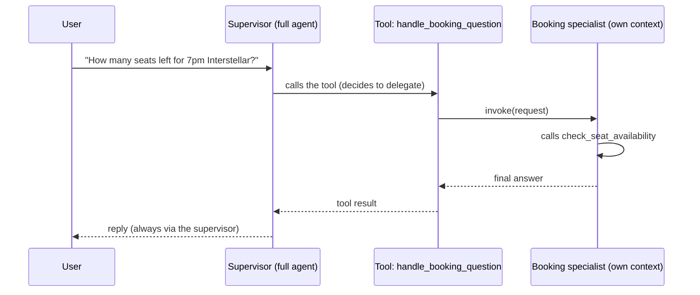

### Watching the Flow, Step by Step

To make it visible, Mayank added `print` statements inside the tool functions ("the way I used to learn coding") and re-ran it. The trace showed *delegating booking question*, then the specialist's *checking seat availability for the 7 PM Interstellar showing*, then the *booking specialist result*. Three observations came out of it:

- **The specialist didn't receive the user's exact words.** The supervisor re-phrased the request when it called the tool, and the specialist, using its own brain, extracted what it needed (7 PM, Interstellar) before calling its own tool. Two different brains, two different messages.
- **The result wasn't just the tool's raw output.** The specialist added a follow-up ("would you like to reserve any of these?"), so what flows back is a model-written answer.
- **The supervisor only delegates when it must.** Asking "Hi, how are you?" triggered no agent call at all, since it can answer generic queries itself. That is the "dynamic call when required" benefit: generic queries stay cheap, and the specialist, which can use a cheaper model and its own tools, is called only for domain work.

### A Second Subagent, Added Live

Mayank asked Claude to add a ticket-booking subagent in the same style: a `ticket_specialist` with a `book_tickets` tool, wrapped by `handle_ticket_booking`, and given to the supervisor alongside the booking tool. The supervisor's prompt was then adjusted to say it should book two seats *if available* without asking the user unnecessarily. The trace showed the supervisor calling the booking specialist first, then the ticket specialist, which is a real two-step delegation. The first run asked the user for confirmation instead of booking; tightening the supervisor's prompt fixed that. Model calls obviously went up with two agents.

### The Rules of the Subagent Pattern

| Question | Answer from class |
|---|---|
| Who talks to the user? | **Only the supervisor.** A subagent's result always returns to the supervisor, which can add to or change it. You invoked the supervisor, so the reply always comes back through it. |
| Is it stateless? | Yes. Subagents keep no state; the main agent holds the conversation. |
| Can one subagent call another? | **Not by default.** The booking and ticket specialists aren't connected; they only meet via the supervisor. You *can* wire them together deliberately (give one agent the other's tool), but that's a custom choice, not an anti-pattern, just usually more complexity than needed. |
| Can the main agent call a subagent's tools directly? | No. It only calls the tools it was given, which include the subagent-as-a-tool, never the subagent's own tools. |
| Sync or async? | The demo is synchronous, so the supervisor waits. If later steps depend on earlier ones (check seats, *then* book), it has to wait anyway. Independent tasks can run asynchronously. |
| How is context passed? | The main agent decides what to send in the tool call. |
| What if a subagent fails? | The supervisor runs in a loop and can retry. |
| Can each agent have a different model? | Yes: a subagent is a standalone agent, so it can use a cheaper or stronger model than the supervisor. |

### Why Not Just Give the Supervisor the Tool?

With one tool, a subagent *is* overkill, and Mayank said so plainly. The value shows up at 10, 50, or 100 tools, where it's far better to hand them to specialized agents (booking, cancellation, customer queries) than to overload one prompt. Mayank's analogy: the supervisor is a manager, and *for your manager to get work done from you, you are just a tool*. He showed the same shape in n8n's visual workflow tool, and said Claude does it too: a separate agent called as a tool. Nesting works to any depth, since each level is still an agent built on LangChain.

---

## 2️⃣ Handoffs: One Agent in Different Clothes

The pattern Mayank warned would confuse the most people. The idea of a handoff is simple: **the task is handed to a specialist, who then talks to the user directly, with nothing in between.**

Mayank's customer-care analogy: you call one number and are transferred between departments. After the transfer you talk to the new person directly, and the person who transferred you is out of the picture.

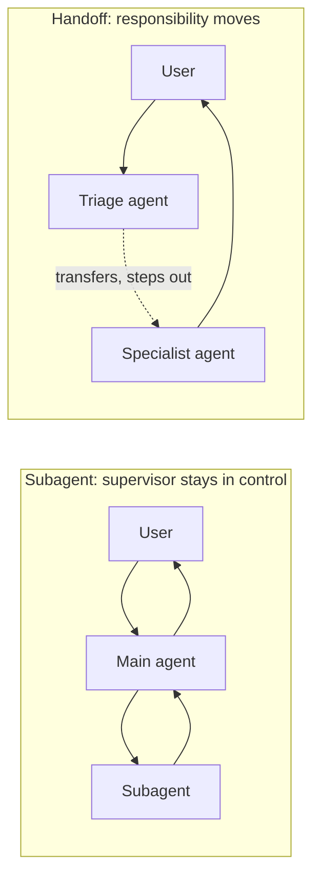

### How Other Frameworks Do It

OpenAI coined the term in its experimental **Swarm** project: agents delegate work to other agents using a special tool call (for example a `transfer_to_sales` tool). **AutoGen** has the same concept with a triage agent that transfers directly and a team that runs the group. Mayank said the nicest handoff support he's seen is in AutoGen or CrewAI, which support a team or crew natively, though he found AutoGen's team-creation docs harder to follow than they needed to be.

### How LangChain Does It

LangChain doesn't build several agents and transfer between them. Instead it keeps **a single agent** and changes its **prompt and tools** based on a state variable. An agent is, after all, just a structure where you can swap the tools and the prompt.

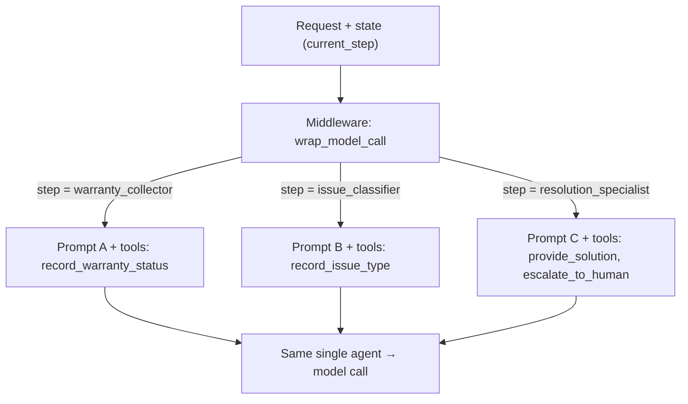

Mayank's analogies for it: the agent is the actor and the **middleware is the make-up artist**, turning the same actor into an elder person or a thief depending on the state. Or: you walk into the same staff room and talk to a maths teacher, a geography teacher, or a history teacher, but the "teacher" you reach has been given a calculator, a map, or Wikipedia depending on your question. You always connect directly to the agent you need.

### The Minimal Version (From the Overview Notebook)

This is where the class started: a ticket state that is either `greeting` or `booking`, and middleware that overrides the system prompt accordingly.

```python
from langchain.agents import AgentState, create_agent
from langchain.agents.middleware import wrap_model_call, ModelRequest, ModelResponse
from typing_extensions import NotRequired
from typing import Literal, Callable

class TicketState(AgentState):
    stage: NotRequired[Literal["greeting", "booking"]]

@wrap_model_call
def apply_stage(request: ModelRequest, handler: Callable[[ModelRequest], ModelResponse]) -> ModelResponse:
    stage = request.state.get("stage", "greeting")
    if stage == "greeting":
        request = request.override(system_prompt="Greet the customer and ask what movie they want.")
    else:
        request = request.override(system_prompt="Help the customer pick a showtime and confirm the booking.")
    return handler(request)

handoff_agent = create_agent(model, tools=[], middleware=[apply_stage], state_schema=TicketState)
result = handoff_agent.invoke({"messages": [{"role": "user", "content": "Hi"}], "stage": "greeting"})
```

### The Full Version: Customer Support as a State Machine

The project notebook builds the realistic version, a support agent that moves through three steps: collect the warranty status, classify the issue (hardware or software), then resolve it or escalate to a human.

**1. State.** Extend `AgentState` with the current step and the facts collected so far.

```python
from langchain.agents import AgentState
from typing_extensions import NotRequired
from typing import Literal

SupportStep = Literal["warranty_collector", "issue_classifier", "resolution_specialist"]

class SupportState(AgentState):
    """State for the customer support workflow."""
    current_step: NotRequired[SupportStep]
    warranty_status: NotRequired[Literal["in_warranty", "out_of_warranty"]]
    issue_type: NotRequired[Literal["hardware", "software"]]
```

`NotRequired` (from `typing_extensions`) marks a key as optional, which is why the state is valid before anything has been recorded; the workflow simply assumes the first step when `current_step` is missing.

**2. Tools that drive the workflow.** The state-changing tools return a `Command` that updates both the data collected *and* `current_step`. That update *is* the transition.

```python
from langchain.tools import tool, ToolRuntime
from langchain.messages import ToolMessage
from langgraph.types import Command

@tool
def record_warranty_status(
    status: Literal["in_warranty", "out_of_warranty"],
    runtime: ToolRuntime[None, SupportState],
) -> Command:
    """Record the customer's warranty status and transition to issue classification."""
    return Command(update={
        "messages": [ToolMessage(content=f"Warranty status recorded as: {status}",
                                 tool_call_id=runtime.tool_call_id)],
        "warranty_status": status,
        "current_step": "issue_classifier",
    })

@tool
def record_issue_type(
    issue_type: Literal["hardware", "software"],
    runtime: ToolRuntime[None, SupportState],
) -> Command:
    """Record the type of issue and transition to resolution specialist."""
    return Command(update={
        "messages": [ToolMessage(content=f"Issue type recorded as: {issue_type}",
                                 tool_call_id=runtime.tool_call_id)],
        "issue_type": issue_type,
        "current_step": "resolution_specialist",
    })

@tool
def escalate_to_human(reason: str) -> str:
    """Escalate the case to a human support specialist."""
    return f"Escalating to human support. Reason: {reason}"

@tool
def provide_solution(solution: str) -> str:
    """Provide a solution to the customer's issue."""
    return f"Solution provided: {solution}"
```

Mayank's point on these tools: a tool can *work on the state*. A real one could check a warranty on the web and set `warranty_status` itself: in warranty means routing to free customer care, out of warranty means routing to paid care.

**3. A prompt and tool set per step.** Each step is defined as a dictionary entry, and `requires` lists what state must already exist.

```python
WARRANTY_COLLECTOR_PROMPT = """You are a customer support agent helping with device issues.

CURRENT STAGE: Warranty verification

At this step, you need to:
1. Greet the customer warmly
2. Ask if their device is under warranty
3. Use record_warranty_status to record their response and move to the next step

Be conversational and friendly. Don't ask multiple questions at once."""

ISSUE_CLASSIFIER_PROMPT = """You are a customer support agent helping with device issues.

CURRENT STAGE: Issue classification
CUSTOMER INFO: Warranty status is {warranty_status}

At this step, you need to:
1. Ask the customer to describe their issue
2. Determine if it's a hardware issue (physical damage, broken parts) or software issue (app crashes, performance)
3. Use record_issue_type to record the classification and move to the next step

If unclear, ask clarifying questions before classifying."""

RESOLUTION_SPECIALIST_PROMPT = """You are a customer support agent helping with device issues.

CURRENT STAGE: Resolution
CUSTOMER INFO: Warranty status is {warranty_status}, issue type is {issue_type}

At this step, you need to:
1. For SOFTWARE issues: provide troubleshooting steps using provide_solution
2. For HARDWARE issues:
   - If IN WARRANTY: explain warranty repair process using provide_solution
   - If OUT OF WARRANTY: escalate_to_human for paid repair options

Be specific and helpful in your solutions."""

STEP_CONFIG = {
    "warranty_collector": {"prompt": WARRANTY_COLLECTOR_PROMPT, "tools": [record_warranty_status], "requires": []},
    "issue_classifier": {"prompt": ISSUE_CLASSIFIER_PROMPT, "tools": [record_issue_type], "requires": ["warranty_status"]},
    "resolution_specialist": {"prompt": RESOLUTION_SPECIALIST_PROMPT, "tools": [provide_solution, escalate_to_human],
                              "requires": ["warranty_status", "issue_type"]},
}
```

You can think of this as defining three "agents" purely through prompts and tools. Only one of them ever faces the user, and the structure resembles a `switch` statement, except it has to live inside one agent, which is why middleware is used.

**4. Step-based middleware.** On every model call, it reads `current_step`, validates what's needed, and overrides the prompt and tools for that turn.

```python
from langchain.agents.middleware import wrap_model_call, ModelRequest, ModelResponse
from typing import Callable

@wrap_model_call
def apply_step_config(request: ModelRequest,
                      handler: Callable[[ModelRequest], ModelResponse]) -> ModelResponse:
    """Configure agent behavior based on the current step."""
    current_step = request.state.get("current_step", "warranty_collector")   # default: first step
    step_config = STEP_CONFIG[current_step]

    for key in step_config["requires"]:
        if request.state.get(key) is None:
            raise ValueError(f"{key} must be set before reaching {current_step}")

    system_prompt = step_config["prompt"].format(**request.state)
    request = request.override(system_prompt=system_prompt, tools=step_config["tools"])
    return handler(request)
```

The `requires` check matters: a request can't skip ahead to the issue step without the warranty status, just as you can't book tickets without knowing how many you need. It fails loudly instead of misbehaving silently.

**5. The agent, with a checkpointer.** The checkpointer is what persists state between turns.

```python
from langchain.agents import create_agent
from langgraph.checkpoint.memory import InMemorySaver

checkpointer = InMemorySaver()
support_agent = create_agent(
    model,
    tools=[record_warranty_status, record_issue_type, provide_solution, escalate_to_human],
    state_schema=SupportState,
    middleware=[apply_step_config],
    checkpointer=checkpointer,
)
```

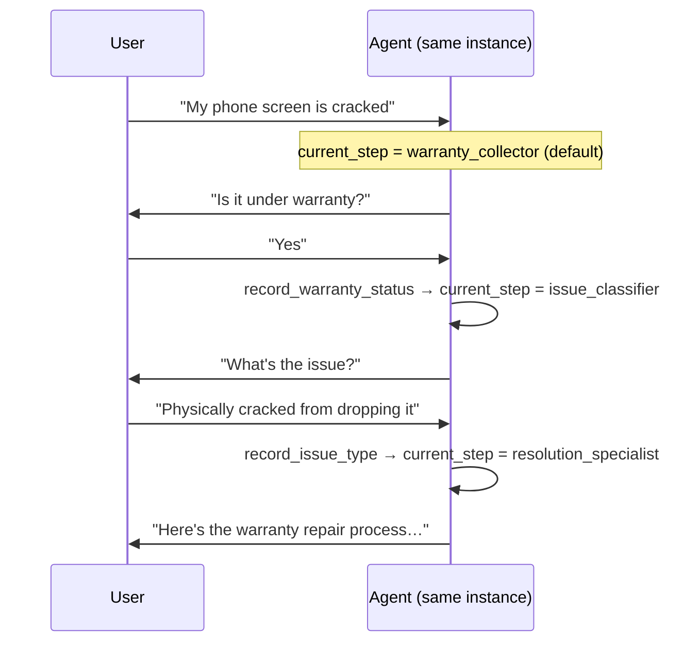

**How state flows between steps:** the tool writes it; the checkpointer persists it; the next turn's middleware reads it back. The maths-teacher analogy again: the maths teacher records "needs calculation = true", and when you move to the geography teacher in the next call, that value is still there to be read.

### Two Gotchas From the Notebook

- **Tools must be registered when the agent is created.** Middleware can *narrow* which registered tools are visible on a step, but it can't introduce new ones. Adding tools later (for example "go back" tools) means rebuilding the agent, and reusing the **same** `checkpointer` object so history survives.
- **Every state-changing tool needs a matching `ToolMessage`.** A tool that only returns a `Command(update={"current_step": ...})` with no `ToolMessage` raises an error on its first call. That's why each state-changing tool takes a `ToolRuntime` and includes one.

### "But Is This Really a Handoff?"

A learner (Basavanna) pushed hard on this: in a Unix-style analogy, a handoff means the child does its job and exits, while a subagent returns to the parent. Here nothing is "handed off" at all; one agent just changes behavior. Mayank agreed that LangChain's implementation *could* be better (it should let you define a team and transfer directly) but held that this is the handoff pattern *as LangChain recommends doing it*. It satisfies the defining property: **the agent that receives the request is the agent that responds**, with no orchestrator in between. "LangChain hasn't given you another way," he said, and a framework-level difference doesn't change the concept.

### Handoff vs. Subagent, in One Line Each

- **Subagent:** the main agent stays in control, uses the sub-agent's result, and replies to you. You can't reach a subagent directly.
- **Handoff:** your request is transferred, and the specialist replies directly. Context can still be shared or summarized between steps, but the *responding* agent is the one that holds your request.

For the interview: **if you're building anything customer-care related, handoff is the best-fitting pattern**: Amazon, Zomato, Swiggy-style support, where a person transfers your call. Mayank also tied it back to the earlier VIP booking example: that was a lighter form of the same idea, overriding *tools* by state, while handoff overrides prompts too.

### Changing the Model by State

Because `ModelRequest` carries the model too, middleware can override it exactly like it overrides the prompt: `request.override(model=...)`. The class's example: a **cheap model** (Haiku) for the warranty collector, a mid-tier one (Sonnet) for classification, and the strongest (Opus) for resolution, according to the effort each step needs. The model can also be chosen by a function, or even by another LLM or classifier picking from a list; there's no single right way, and you'd test it. If it's dynamic, middleware is what handles it.

---

## 3️⃣ Skills: Prompts Loaded on Demand

Mayank called skills the simplest pattern, and said honestly that he isn't sure why LangChain groups them under multi-agent: *there is just one agent*. A skill is **a specialized prompt the agent loads when it needs it**, the same idea behind skills in Claude, Kiro, and others. He showed it live in Claude: asking it to reply to his manager about a holiday made it load a manager-email skill, which carried the instructions for writing that kind of email, and then draft the message.

### The Minimal Version

```python
SKILLS = {
    "refund_policy": (
        "You are answering refund questions. Policy: full refund if cancelled >2 hours before "
        "showtime; 50% store credit within 2 hours; no refund after the showtime starts."
    ),
    "loyalty_program": (
        "You are answering loyalty-program questions. Members earn 1 point per $1 spent; "
        "100 points = one free ticket; points expire after 12 months."
    ),
}

@tool
def load_skill(skill_name: str) -> str:
    """Load a specialized skill prompt.

    Available skills:
    - refund_policy: Refund and cancellation policy expert
    - loyalty_program: Loyalty points and rewards expert

    Returns the skill's prompt and context.
    """
    return SKILLS.get(skill_name, f"Unknown skill: {skill_name}")

skills_agent = create_agent(
    model,
    tools=[load_skill],
    system_prompt=(
        "You are a helpful CineBot assistant. You have access to skills: "
        "refund_policy and loyalty_program. Use load_skill to access them when relevant."
    ),
)
```

A live experiment showed *why the tool's description matters*. With the skill names removed from the docstring, the model guessed a name (a "refund and cancellation policy" skill) that doesn't exist. With the exact names back in the description, it called `refund_policy` correctly. The model can only choose among skills it can see: you can't pick a dish without looking at the menu.

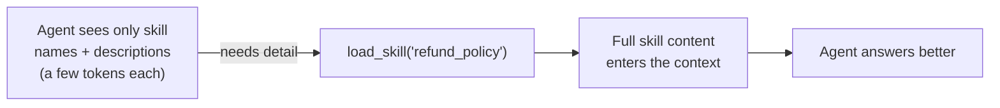

A skill can also tell the agent how to use *other tools*. A refund-policy skill might say to use a `process_refund` tool, so the agent uses its tools more effectively. Skills make the *agent* better, not the tools; the model is still the one deciding what to call.

### The Better Version: Skill-Discovery Middleware

Hard-coding skill names into a docstring doesn't scale: add a skill tomorrow and you'd have to edit it everywhere. The project notebook's approach defines skills with a name, a short description, and full content, then uses middleware to inject only the names and descriptions into the system prompt on every model call:

```python
from typing import TypedDict, Callable
from langchain.agents.middleware import ModelRequest, ModelResponse, AgentMiddleware
from langchain.messages import SystemMessage

class Skill(TypedDict):
    """A skill that can be progressively disclosed to the agent."""
    name: str
    description: str
    content: str

# SKILLS: list[Skill] = [ {"name": "sales_analytics", "description": "...", "content": "# Sales Analytics Schema ..."},
#                         {"name": "inventory_management", ... } ]

# (here `load_skill` is the notebook's version, which looks the skill up by name in SKILLS
#  and returns its full content)
class SkillMiddleware(AgentMiddleware):
    """Middleware that injects skill descriptions into the system prompt."""

    tools = [load_skill]  # registered as a class variable

    def __init__(self):
        skills_list = [f"- **{skill['name']}**: {skill['description']}" for skill in SKILLS]
        self.skills_prompt = "\n".join(skills_list)

    def wrap_model_call(self, request: ModelRequest,
                        handler: Callable[[ModelRequest], ModelResponse]) -> ModelResponse:
        skills_addendum = (
            f"\n\n## Available Skills\n\n{self.skills_prompt}\n\n"
            "Use the load_skill tool when you need detailed information "
            "about handling a specific type of request."
        )
        new_content = list(request.system_message.content_blocks) + [{"type": "text", "text": skills_addendum}]
        return handler(request.override(system_message=SystemMessage(content=new_content)))

sql_agent = create_agent(
    model,
    system_prompt="You are a SQL query assistant that helps users write queries against business databases.",
    middleware=[SkillMiddleware()],
    checkpointer=InMemorySaver(),
)
```

What this buys you, in Mayank's words, is *progressive disclosure*: the content can be hundreds of lines long, but the model sees only a name and description (perhaps 20 to 30 tokens per skill, so even 100 skills is around 2,000 tokens) until it actually loads one. Skills do add tokens, and he said so directly: names and descriptions are sent on every call, and loaded content grows the context.

### Skills as Tool or as Middleware

Both work, and it's the developer's call. A `load_skill` tool alone lets the model load a skill, while middleware makes skills *discoverable* by injecting their descriptions. Note that the middleware's `tools = [load_skill]` registers the loader with the agent. Since a skill is just structured data, you can add a key like `allowed: bool` and skip disallowed skills when the middleware builds the prompt. That's roughly how a product like Claude could let you switch an individual skill on and off. As he'd last read it, in Claude the larger models (Sonnet, Opus) read skill details dynamically when needed, while on the smallest model (Haiku) the name and description of every skill is sent up front.

### Skills: What They Are and Aren't

- **Just instructions.** Skills are a "prompt repo": reusable instructions, not a different kind of agent. Use them for complex tasks or specific use cases where you don't want to repeat the same long instructions every time (a code-review skill, an artifact-creator skill).
- **Not RAG.** The difference comes up later, when RAG is taught.
- **Interview angle.** Many people use skills in Claude, but few know how to define and load them with LangChain. Mayank's advice: say it out loud. When asked "do you use Claude?", mention that you also understand how skills are built, because the natural follow-up is "tell me how", and then *you* are anchoring the interview. That only works if you really know it.

---

## 4️⃣ Router: Classify, Fan Out, Synthesize

A router is a step that decides which specialist agents should handle a query, queries them (often **in parallel**), and merges their answers. The project notebook builds a multi-source knowledge base over GitHub, Notion, and Slack. The three specialists are plain agents, each with its own tools and prompt:

```python
github_agent = create_agent(
    model,
    tools=[search_code, search_issues, search_prs],
    system_prompt=(
        "You are a GitHub expert. Answer questions about code, "
        "API references, and implementation details by searching "
        "repositories, issues, and pull requests."
    ),
)
# notion_agent: tools=[search_notion, get_page]   (a Notion expert for docs and policies)
# slack_agent:  tools=[search_slack, get_thread]  (a Slack expert for team discussions)
```

**Three small state types** keep the data tidy: what each agent receives, what it returns, and the overall workflow state, where a **reducer** merges parallel results into one list.

```python
from typing import Annotated, Literal
from typing_extensions import TypedDict
import operator

class AgentInput(TypedDict):
    query: str

class AgentOutput(TypedDict):
    source: str
    result: str

class Classification(TypedDict):
    source: Literal["github", "notion", "slack"]
    query: str

class RouterState(TypedDict):
    query: str
    classifications: list[Classification]
    results: Annotated[list[AgentOutput], operator.add]  # reducer collects parallel results
    final_answer: str
```

**The workflow.** The entry point is a *function* that classifies the query with structured output, a `Send` per chosen source fans out in parallel, and a final node synthesizes.

```python
from pydantic import BaseModel, Field
from langgraph.graph import StateGraph, START, END
from langgraph.types import Send

class ClassificationResult(BaseModel):
    classifications: list[Classification] = Field(
        description="List of agents to invoke with their targeted sub-questions")

def classify_query(state: RouterState) -> dict:
    structured_llm = router_llm.with_structured_output(ClassificationResult)
    result = structured_llm.invoke([
        {"role": "system", "content": "Analyze this query and determine which knowledge bases to consult. ..."},
        {"role": "user", "content": state["query"]},
    ])
    return {"classifications": result.classifications}

def route_to_agents(state: RouterState) -> list[Send]:
    return [Send(c["source"], {"query": c["query"]}) for c in state["classifications"]]

workflow = (
    StateGraph(RouterState)
    .add_node("classify", classify_query)
    .add_node("github", query_github)
    .add_node("notion", query_notion)
    .add_node("slack", query_slack)
    .add_node("synthesize", synthesize_results)
    .add_edge(START, "classify")
    .add_conditional_edges("classify", route_to_agents, ["github", "notion", "slack"])
    .add_edge("github", "synthesize")
    .add_edge("notion", "synthesize")
    .add_edge("slack", "synthesize")
    .add_edge("synthesize", END)
    .compile()
)
result = workflow.invoke({"query": "How do I authenticate API requests?"})
```

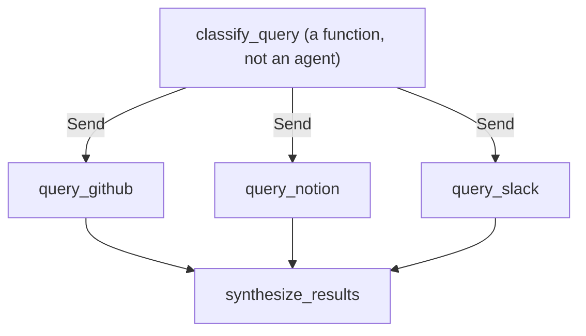

Two details Mayank stressed, since they separate a router from a supervisor:

- **The classifier has no brain of its own.** It can't answer anything; it's just a function that decides who to call. A supervisor, by contrast, is a full agent: say "hi" to it and it replies without calling anyone, while a router's classify step would still try to send it somewhere.
- **Synthesis exists because the user should get one answer.** If two agents respond, you don't send two outputs; the router combines them. It doesn't return to the router, and the router isn't the one finally replying.

**Why LangGraph here:** LangGraph lets you build a graph whose *entry point isn't an agent*, so the entry point can be the classify function. Mayank said the graph syntax would be unpacked properly in the LangGraph module; for now the idea is enough. (A flowchart is a good mental picture of a graph.) The notebook notes why this was written with a reducer: without one, LangGraph would error the moment two parallel branches wrote to the same key in the same step.

**A router can use a classifier model instead of an LLM.** A small classification model just picks the destination, so it's quick and cheap, a great cost saver (the model's name is garbled in the recording; Mayank pointed to his own video on it). It can say whether one agent or several are needed.

For multi-turn conversations, the notebook recommends the simplest approach: **wrap the stateless router as a tool** that a conversational agent (with a checkpointer) calls. The agent handles memory; the router stays stateless. A full-persistence router is possible but adds real complexity, and handoffs or subagents give clearer multi-turn behavior.

---

## ⚖️ Choosing a Pattern

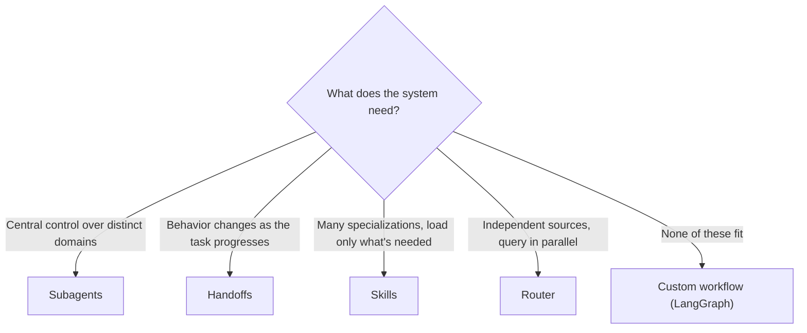

The comparison table from LangChain's docs, as shown in the class notebook:

| Optimize for | Subagents | Handoffs | Skills | Router |
|---|:-:|:-:|:-:|:-:|
| Distributed development | ⭐⭐⭐⭐⭐ | - | ⭐⭐⭐⭐⭐ | ⭐⭐⭐ |
| Parallelization | ⭐⭐⭐⭐⭐ | - | ⭐⭐⭐ | ⭐⭐⭐⭐⭐ |
| Multi-hop (chaining several subagents) | ⭐⭐⭐⭐⭐ | ⭐⭐⭐⭐⭐ | ⭐⭐⭐⭐⭐ | - |
| Direct user interaction | ⭐ | ⭐⭐⭐⭐⭐ | ⭐⭐⭐⭐⭐ | ⭐⭐⭐ |

In class, Mayank emphasized two points from this: subagents allow agents to be developed, even deployed, separately, and handoff is where the user talks directly to the responding agent.

### What Actually Matters: Latency and Cost

Mayank said that, at the end of the day, two numbers matter to him: **latency** (time) and **cost** (tokens and context window). The quality of answers can be steered with prompts. LangChain's own comparison counts model calls, and he walked through the coffee-ordering example:

| Scenario | Subagents | Handoffs | Skills | Router |
|---|:-:|:-:|:-:|:-:|
| One-shot request ("buy a coffee") | 4 calls | 3 | 3 | 3 |
| Repeat request | 8 calls | 5 | 5 | 6 |

Why subagents cost more: the main agent calls the subagent as a tool, the subagent works, returns, and the main agent calls the model again to reply. Handoffs and skills are *stateful*, so on a repeat request they skip re-routing or re-loading. Note that the "calls" counted are model calls, not tool calls.

### Why Not Just Use Handoff for Everything?

A student asked. Because **context isn't isolated** in a handoff: it's one agent whose context keeps growing, whereas a subagent works in its own window. And in a handoff, nothing sits between the user and the agent, which is the point for support but not for orchestrating independent domains. The patterns also combine: a subagent architecture can have handoff or skills inside it.

### LangChain or CrewAI/AutoGen?

Asked which is best for production on latency, cost, stability, and observability, Mayank's answer was LangChain or LangGraph, and the reason is **control**. CrewAI defines an agent by *role, goal, and backstory*, and runs a crew with a *sequential* or *hierarchical* process, which is quick, but you get little insight into what's happening inside, so when a crew burns many tokens, you can't directly change it. In LangChain (and LangGraph) you control each step through middleware. His analogy: lower-level control is why production systems prefer Go or Java for concurrency. It's *possible* in CrewAI, just harder to gauge and handle. The concepts are the same either way.

---

## 🏗️ Preview: The Meridian AI Project

Mayank closed with the overview of the project that starts next class, calling it the first real, CV-worthy project of the course ("please don't put CineBot on your CV"). It's a deliberately realistic, production-shaped codebase, one he said took around 2–3 weeks to build and sits at about an 8 out of 10 in difficulty.

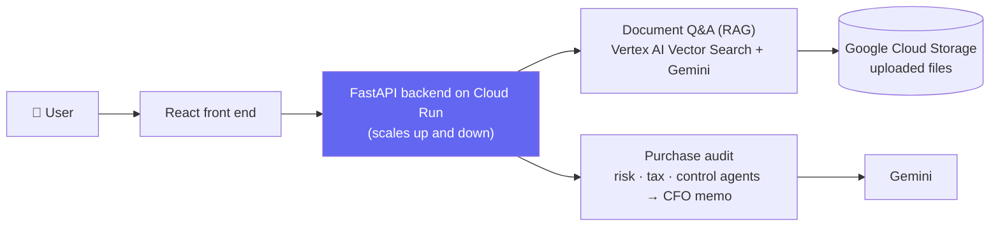

- **Two jobs.** Ask questions of uploaded documents in plain English, and audit a purchase request: three specialist AI agents (risk and compliance, tax, finance control) review it, then a "CFO" step writes a decision memo. That's a multi-step, multi-agent system built from today's patterns.
- **The stack.** React front end, FastAPI backend (with health and status endpoints, an LRU cache, and Pydantic schemas), LangChain, Gemini (chosen because it's best with Google Cloud), Vertex AI embeddings and vector search, Google Cloud Storage for uploads, Docker, Cloud Run, Secret Manager, logging and monitoring, and a GitHub Actions deploy workflow.
- **The fictional company** (Aldermoor Industries, a made-up German manufacturer) is only there so you can see where this applies; Mayank planned to re-skin it for finance. The company-specific "checks" are done by the AI from general knowledge; it's a demo of how such a system is built, not a compliance tool.
- **Free tier is enough.** GCP offers $300 in credits for 90 days. At the time of the class, signing up asked for a roughly ₹1,000 prepayment (he mentioned UPI or card), and he advised keeping auto-pay off. He also said he had never managed to get that prepayment refunded, and invited anyone who figures it out to tell him. AWS isn't an alternative for this one; AWS and Azure projects come later.
- **The homework:** create the GCP account and read the code first. The repo already has the code, a deploy workflow, and a README that explains the technologies in plain language; Mayank said he would add diagrams and a prerequisites list to the repo (the README already covers the technologies in plain language).
- **Not covered yet:** RAG is explained only as far as the project needs, evaluation and observability come in later projects, and MCP isn't in this one, though Mayank offered to add it.

---

## 🗺️ What's Next

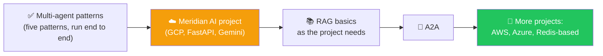

The plan Mayank gave: October is projects (two to three on GCP, at least two on AWS, at least one on Azure), with other frameworks in November and FDE-style client projects around December and January. A learner asked whether the course would end in January or February; the sequence he gave was projects in October, other frameworks in November, then FDE-style projects. A2A and RAG are the main concepts still left; evaluation and observability come through projects. He also said he would *not* be teaching dedicated AI system design (which would stretch the course into next year), though the project explains design decisions and he planned to put system-design material on YouTube.

---

## 🔑 Key Pointers to Remember

- **Multiple agents ≠ multi-agent.** A system is multi-agent only when a workflow wires them together. Know the *difference between patterns*, since that's what interviews probe.
- **Subagents = agent as a tool.** The supervisor keeps control; the result always returns to the supervisor, which replies to you. Subagents are stateless, can have their own model and tools, and keep their own context.
- **Handoff = the agent that receives your request is the one that answers.** In LangChain it's done by changing a *single agent's* prompt and tools based on state, via middleware. The state-changing tools return a `Command` that updates `current_step`.
- **State decides configuration; tools decide state.** A checkpointer is mandatory, or `current_step` resets each turn.
- **Tools must be registered at `create_agent` time.** Middleware can only narrow the visible set, and every state-changing tool needs a `ToolMessage`.
- **Skills are just instructions loaded on demand.** Progressive disclosure keeps context small: only names and descriptions are always sent; the content loads when needed. The tool description (or middleware) is what lets the model pick the right name.
- **A router's classifier isn't an agent.** It's a function (or small classifier model) that picks who to call; results are synthesized, and control doesn't return to the router.
- **Handoff is the natural fit for customer support.** It's also the best-known real-world use case to cite.
- **Latency and cost are the deciding metrics.** Subagents cost more model calls; handoffs and skills are cheaper on repeat requests because they're stateful.
- **A2A is a different thing.** It connects agents built in *different frameworks* (LangChain with CrewAI, say); the patterns here are agents-as-tools inside one framework.
- **Concepts transfer; implementations differ.** Subagents, context, and tools behave the same in other frameworks, and CrewAI/AutoGen simply package it as a "team" or "crew".

---

## 💬 Live Q&A Highlights

| Question | Answer |
|---|---|
| Why use a subagent when the supervisor could just call the tool directly? | For one tool you wouldn't. With 10+ tools, specialist agents keep the main agent's prompt and tool list small, can use cheaper models, and are easier to scale and own separately. |
| Can a subagent return its result directly to the user? | No. You invoked the supervisor, so results always come back through it. It's ordinary tool calling: the tool returns to whoever called it. |
| Does the main agent wait for the subagent? | In the demo, yes (synchronous). Where later steps depend on earlier ones (check seats, then book) it has to wait anyway; independent tasks can run asynchronously. |
| Can one subagent call another? | Not unless you deliberately give one agent the other as a tool. By default, subagents are only connected through the supervisor. |
| Does the supervisor's prompt need to name the tool (e.g. "delegate booking questions")? | It may still route correctly from the tool's description, but explicit instructions raise the odds. It depends on description quality and the model. |
| How are agent-as-a-tool and A2A different? | Agent-as-a-tool is inside one framework. A2A is a protocol between agents in *different* frameworks (e.g. LangChain and CrewAI). |
| Can supervisors be nested to many levels? | Yes. Each level is just an agent built on LangChain, and each can use a different model. |
| Is the handoff pattern a real handoff if it's one agent? | In LangChain's design, yes: the agent that takes your request responds, with nothing in between. The implementation could be neater (AutoGen/CrewAI use native teams), but it is the pattern. |
| How does state move between handoff steps? | A tool writes it into the state schema, the checkpointer persists it, and the next turn's middleware reads it back. The `requires` list raises an error if a needed value is missing. |
| Why `NotRequired` on the state fields? | It marks a key as optional (from `typing_extensions`), so the state is valid before anything has been recorded; the first step is assumed by default. |
| Can the model be changed by state? | Yes: `request.override(model=...)` in the same middleware, alongside prompt, tools, and messages. A function (or a classifier) can pick the model, with no single "best" rule. |
| Does a large `tools` list inflate the checkpointer? | No, tools are just variables. The cost is what goes to the LLM, and middleware sends only the current step's tools. |
| Is `load_skill` just a function around a prompt? Is it dynamic? | Yes, it's essentially a prompt repo, loaded dynamically on demand. Skills are longer in practice than the demo's one-liners. |
| How do you turn a skill off? | Add a flag such as `allowed` to the skill and skip disallowed ones when the middleware builds the prompt. |
| How is a skill different from RAG? | Different mechanisms; the comparison comes when RAG is taught. |
| When should I use skills vs. a plain config prompt? | Skills for complex or reusable tasks you'd otherwise re-explain; for simple behavior changes, prompts or state-based config are enough. |
| Is a router the same as a handoff? | No. A router classifies once, fans out in parallel, and synthesizes; a handoff transfers the conversation to a specialist who replies directly. |
| Do these patterns apply with MCP tools? | Yes. MCP servers just provide tools, so everything about agents and tools applies; you'd source tools from MCP instead of defining them yourself. |
| Is observability needed for these? | Yes, once state gets complex. |
| Which framework is best for production? | LangChain/LangGraph, for the low-level control that gives better cost and observability. CrewAI is quicker but gives less insight. |
| How do I optimize cost across multiple LLMs dynamically? | Override the model in middleware with a function (or classifier) that picks by request, latency, or cost. There's no universal rule, so test. |
| Will Meridian AI run on the free tier? | Yes, deliberately, so you don't have to spend money. |
| Can I follow the project on AWS? | No, use GCP for this one. AWS and Azure projects come later. |
| Why Cloud Run and not Vertex AI Agent Engine? | The goal is to teach LangChain development; Agent Engine is simple to use and was planned with ADK instead. Its pricing can also run high, so he spins it up and shuts it down. |
| Does Meridian AI do fact-checking of LLM answers? | Only basic-level checks. Fuller fact-checking and evaluation are planned for a later project; send him your company's method if you have one. |
| I'm non-technical or new to coding: how should I tackle the project? | Read the code *before* class; ask ChatGPT/Claude to explain React or other unfamiliar parts. Docker and cloud steps will be explained at a high level; line-by-line coding isn't feasible within the timeline. |
| Is the course useful for FDE (forward-deployed engineer) roles? | Yes, stay with this course. FDE-style projects, including a real client engagement, come around December and January. |
| Are agent templates a shortcut for production? | They give a start, perhaps 25 to 30% of a real production solution; you still need depth to control the rest. LangChain and GitHub publish agent templates. |
| Should I use MCP at a product company? | It depends on the company's needs. Mayank uses MCP for POCs, but when he knows the exact tool, he calls the API directly. |
| For a path-finding game agent choosing among four moves, LLM or something else? | A small classifier/decision model is far cheaper than an LLM for a fixed set of options. |
| Can production apps be created by vibe-coding? | Not production-grade ones. You still have to understand the system design. To understand an unfamiliar codebase, upload it to ChatGPT or Claude. DeepWiki gives documentation, not an architecture flow. |
| Mermaid diagrams don't render in VS Code notebooks — what to do? | Update (or reinstall) VS Code, since recent versions render Mermaid natively in the markdown preview, or install a Mermaid extension. |
| How do I structure a modular project in VS Code? | It's covered when the project starts. Meanwhile, put the project zip into ChatGPT and ask, and spend four or five hours on the code first. |

---

## ✅ Action Items After Class 25

- [ ] 📓 Run `00_Multi_Agent_Overview` and each of the four project notebooks (subagents, handoffs, router, skills) with your own OpenAI key, and print what each pattern does
- [ ] 👥 Build the booking specialist + supervisor, add `print` statements inside the tool functions, then add a second subagent and watch the call order
- [ ] 🔁 Rebuild the customer-support handoff: state schema, `Command`-returning tools, `STEP_CONFIG`, step middleware, checkpointer; try the "go back" tools and notice the rebuild-the-agent gotcha
- [ ] 💱 Override the *model* per step in the handoff middleware (cheap → mid → strong) and compare cost
- [ ] 🧠 Create two skills and load them via `load_skill`; remove the names from the tool description and see what the model guesses; then move to `SkillMiddleware`
- [ ] 🧭 Build the router, then try a query that needs one source and one that needs two; confirm the reducer is what lets parallel results merge
- [ ] 🎯 Write a one-paragraph answer to "what's the difference between a router and a handoff?" in your own words
- [ ] ☁️ Create your GCP free-trial account and **read the Meridian AI code** (including the README and `deploy.yml`) before next class

---

*📝 Notes compiled from the full Class 24 transcript and the class's Weekend 14 code (the `Multi Agents in Langchain` notebooks, `README`, and the `meridian-ai-learner` repo) — "Multi-Agent Patterns in LangChain," Agentic AI 3.0 Specialization, Krish Naik Academy.*
